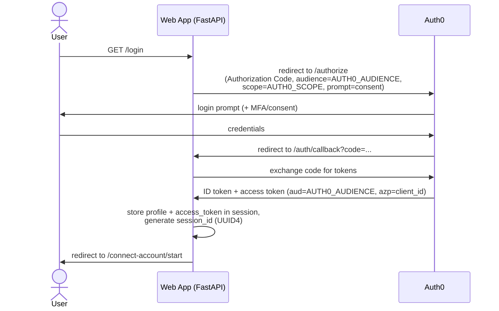
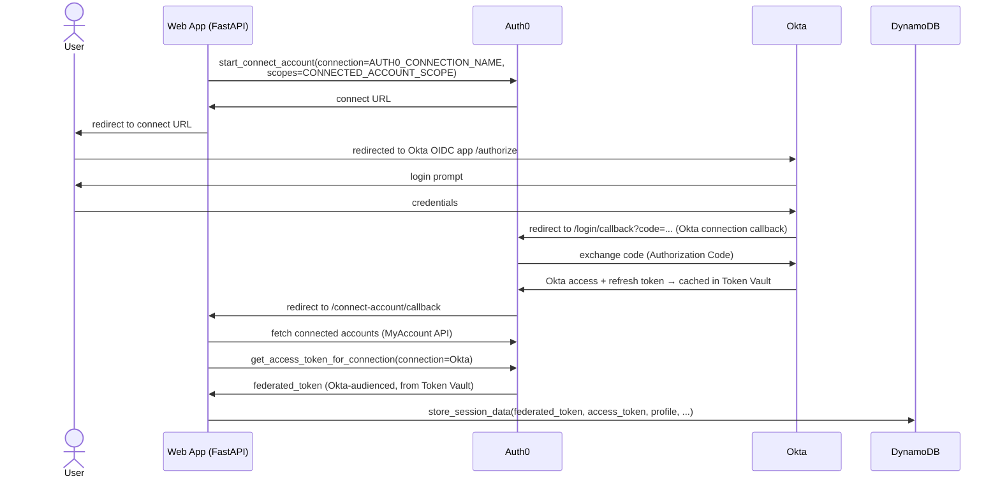
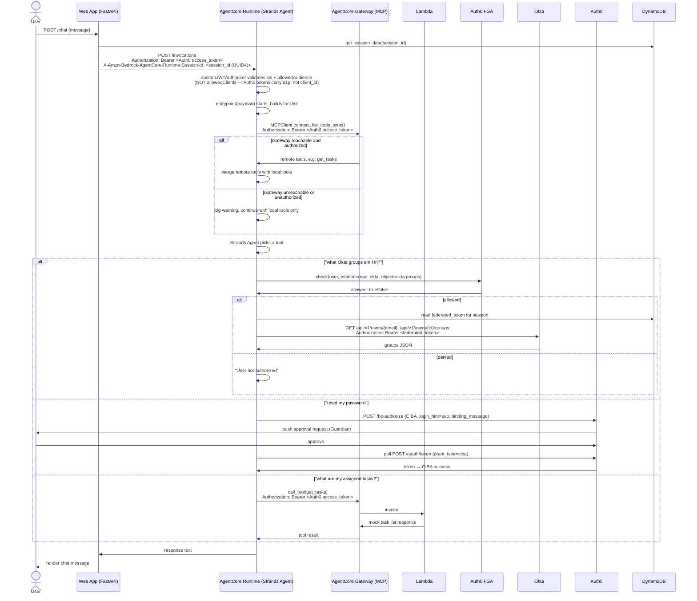

# AgentCore Auth0 Web App

# Setup Guide — Auth0-Secured Agent on AWS Bedrock AgentCore

This is the working setup guide for this repo. It follows the
structure of Auth0's blog post [Securing Amazon Bedrock AgentCore Agents with Auth0
for AI Agents](https://auth0.com/blog/securing-amazon-bedrock-agentcore-agents-auth0-for-ai-agents/)
but corrects a number of gaps, bugs, assumptions and outdated instructions found while following the original instructions. All fixes including setup instructions are contained within this repo. For the full chronological account of *why* each correction below exists, see
[`docs/se-notes.md`](docs/se-notes.md), but this document only gives you the distilled,
actionable version required to get things running for the APJ SE Summit.

## 1. Introduction / Solution Overview

This lab demonstrates an AI agent, hosted on AWS Bedrock AgentCore Runtime, that acts
on a user's behalf against a third-party identity system (Okta) — with every hop
governed by Auth0. A user logs into a FastAPI web app via Auth0. The web app then
walks the user through Auth0's **Connected Accounts** flow (backed by **Token Vault**),
which links the user's Auth0 identity to their Okta account and caches a delegated
Okta access token — the agent never sees the user's Okta password, and never holds a
long-lived standing credential of its own. When the user chats with the agent, the web
app calls the AgentCore Runtime with the user's own Auth0 access token as a bearer
credential; the Runtime's `customJWTAuthorizer` validates that token before the request
ever reaches the agent process. Inside the agent (a Strands Agent), every sensitive
action is gated: reading Okta group membership is preceded by a fine-grained
authorization check against **Auth0 FGA** (a relationship-based, Zanzibar-style
authorization model), and resetting a password requires **step-up authentication** via
**CIBA** (Client-Initiated Backchannel Authentication) — a push approval to the user's
own device, independent of the chat session.

Separately, the agent also acts as an MCP client against an
**AWS Bedrock AgentCore Gateway** (this would be swapped out later for an Auth0 Agent Gateway when available), to centralise tools and enalbe dynamic requests of them at run 
time rather than as a directly-coded within individual clients. In this lab, the Gateway's only target
is a plain **AWS Lambda function**, wrapped via the Gateway's "Lambda ARN" target type
and a Target Schema — it's a deliberately lightweight mock (a hardcoded "list my
assigned tasks" response), not a real backend service, and not a genuine MCP server
implementation itself. What the Gateway adds is discoverability and a standard MCP
interface on top of that Lambda: from the agent's point of view it's just another MCP
tool, callable the same way a real one would be. The Gateway enforces its own inbound
authorization — a JWT authorizer configured separately from, but parallel to, the
Runtime's own — and the agent authenticates to it using the same Auth0 access token
used everywhere else in this flow. This is a real part of the lab, not an optional
extra: it's what lets the agent unify directly-coded tools with dynamically-discovered
remote tools behind one interface, and Section 5.10 covers setting it up.

The point of the lab is the delegation chain: Auth0 login → Auth0 Token Vault → Okta
API, and Auth0 login → AWS AgentCore Runtime → Strands Agent → Auth0 FGA → Okta API /
CIBA, and Auth0 login → AWS AgentCore Runtime → Strands Agent → AWS AgentCore Gateway
(MCP) → Lambda, all governed by short-lived, audience-scoped tokens rather than static
credentials.

## 2. Flow Diagrams

### 2a. Login to the web app



### 2b. Connected Accounts (Token Vault) — linking Okta



### 2c. Chat — agent invocation, Gateway/MCP tool discovery, FGA check, Okta call / CIBA



## 3. Prerequisites

### Accounts / environments (four, all separate)

1. **Okta org** — a Workforce (starter) template org, not a generic Okta Developer
   org. `getOktaGroups` calls Okta's native Users/Groups API directly, so you need at
   least one test user with real group memberships.
2. **Auth0 tenant** — handles login, Token Vault/Connected Accounts, CIBA, and issues
   the JWTs the AgentCore `customJWTAuthorizer` validates.
3. **Okta TDI Provided AWS account** — Bedrock model access, AgentCore Runtime, ECR, DynamoDB. SSO-based
   access (via `aws configure sso` / `aws sso login`) is sufficient and is what the
   deploy script expects — no IAM User / static access keys needed.
4. **Auth0 FGA store** — a separate product/account from the Auth0 tenant
   (`dashboard.fga.dev`), used for the fine-grained authorization check.

### Tooling

- **laptop working environment**
  - I assume and have only tested on MacOS, if you're doing this on a Windows laptop I wish you luck :')
  - Visual Studio code would provide the most integrated working environment as you will be editing files, running scripts, etc
  - Claude code through Lite LLM will be helpful for troubleshooting
- **git**
  - Check: `git --version`.
  - Install: comes with Xcode Command Line Tools (`xcode-select --install`), or via
    Homebrew: `brew install git`.
  - Upgrade: `brew upgrade git` (if installed via Homebrew).

- **Python 3.10+**
  - Check: `python3 --version` and `which python3` — macOS ships only an ancient
    Command Line Tools `python3`, which is **not** a real 3.10+ interpreter for this
    purpose; you need a separate, real one on your `PATH` (typically via Homebrew).
  - Install: `brew install python@3.12` (or `python@3.11` / `python@3.10`).
  - Upgrade: `brew upgrade python@3.12` (etc., matching whichever formula you installed).
  - Note: this repo's own helper scripts (`deployAgentCore`, `runLocalApp`)
    auto-detect and prefer a Homebrew python3.12/3.11/3.10 over the system one, and
    build their own `.venv` from it. So once at least one real 3.10+ interpreter
    exists anywhere the scripts look, you don't need to manually select or activate
    it yourself — you just need it present.

- **AWS CLI v2**
  - Check: `aws --version` — confirm it reports `aws-cli/2.x`, not `1.x`. This lab's
    scripts and steps use `aws configure sso`, `aws sso login`,
    `aws sts get-caller-identity`, and `aws bedrock list-inference-profiles`, all of
    which require v2.
  - Install: `brew install awscli`, or the
    [official AWS installer](https://docs.aws.amazon.com/cli/latest/userguide/getting-started-install.html).
  - Upgrade (v2.x → v2.y): `brew upgrade awscli`, or re-run the official installer.
  - If you have v1 installed: AWS's own migration docs recommend uninstalling v1
    before installing v2, rather than upgrading in place — both versions use the same
    `aws` command name, so if you install v2 without removing v1 first, whichever one
    is earlier on your `PATH` silently wins. Via Homebrew, `brew uninstall awscli`
    followed by `brew install awscli` handles this cleanly; with the official
    installer, uninstall v1 per its docs, confirm `aws --version` reports nothing,
    then install v2.

- **Auth0 CLI** (`auth0` command)
  - Check: `auth0 --version`.
  - Install: `brew tap auth0/auth0-cli && brew install auth0-cli`.
  - Upgrade: `brew upgrade auth0-cli`.
  - Authenticate (required before the Management-API-backed steps in Section 5, e.g.
    the MRRT policy update via `auth0 apps update`): `auth0 login`, which walks you
    through a device-code flow in your browser against your tenant.

A container engine (Docker/Finch/Podman) is **not** required for this lab's default
deploy path — `./deployAgentCore` builds and deploys via AWS CodeBuild, not a local
container build. You'd only need one for the optional `runtime.launch(local=True)`
alternative deployment mode, which this guide does not use.

Bedrock model access and a currently-available Claude model ID are also required, but
that's a per-account/region configuration matter, not a CLI/SDK tooling install — see
Section 4, "Bedrock model availability."

## 4. Areas to Look Out For

This section is about small, easily-missed details in the *manual* setup steps below —
dashboard clicks, Management API calls, and env var values you have to get right
yourself.

### Okta configuration

- **`OKTA_DOMAIN` must be the bare base org domain** (`<org>.okta.com`), never the
  `-admin` console hostname (`<org>-admin.okta.com`). Hitting `/api/v1/...` against the
  `-admin` host returns a **403 with an empty body** — this looks like a permissions
  problem but is actually Okta's edge blocking an unsupported hostname/path
  combination. (A genuine Okta API 403 has a JSON body like
  `{"errorCode":"E0000006",...}` — an empty body on 403 is the tell.) Don't include a
  scheme prefix either; the code strips `https://`/`http://` itself.

### Getting `okta.users.read` onto the federated token (two settings, both required)

`getOktaGroups` calls Okta's Users/Groups Management API, which needs the `okta.users.read`
scope on the federated token Connected Accounts hands you. Getting this scope onto that
token requires **two separate settings to both be correct** (both are set during the
Auth0 tenant setup steps in Section 5.3 — this is just the "why," so you recognize the
symptom if you skip or mis-order either one):

1. The Okta connection's own default scope (set when you create the connection).
2. `CONNECTED_ACCOUNT_SCOPE` in the root `.env` (already defaults to the right value in
   `env.template` — see Section 5.3).

**Symptom if only (1) is missing**: the My Account API rejects the Connect Account
request outright with `Custom scopes are not allowed for this request`. **Symptom if
only (2) is missing**: Connect Account succeeds, but the resulting token silently lacks
the scope — `getOktaGroups` later 403s with:
```
WWW-Authenticate: Bearer ... scope="okta.users.read", error="insufficient_scope",
error_description="The access token provided does not contain the required scopes."
```
Either way, after fixing both, you must **re-run Connect Account** (log out, log back in,
let it re-trigger, or click through it again) — an already-connected account's cached
token doesn't retroactively pick up a scope change; it only takes effect on re-authorization.

### Bedrock model availability

Whatever `BEDROCK_MODEL_ID` ships as a default in `registerAgent/env.sample` will not
necessarily be available in your own AWS account/region by the time you read this —
Bedrock model IDs and cross-region inference profiles change over time (new ones added,
old ones deprecated). Check the Bedrock console's model catalog (or
`aws bedrock list-inference-profiles --region <region>`) for a currently-live Claude
profile ID before deploying; don't assume the default in the env file is still correct.
There's also a separate, account-level "model use case" gate in the AWS/Anthropic
console that can block a model even when it isn't deprecated — if you get a
"Model use case details have not been submitted" error, that's this, not a deprecation
issue. Leaving `BEDROCK_MODEL_ID` blank in `.env` still counts as "set" (an empty
string), so it will not fall through to any code-level default — it must be a real
value.

## 5. Step-by-Step Instructions

Before starting here, ensure you have all the required tools and environments setup as outlined above in Section 3

Throughout this section, **"Web App .env"** means the env file for the root FastAPI web
app (currently `.env` at the repo root, copied from `env.template`), and **"AgentCore
Deployment .env"** means the env file for the agent itself (currently
`registerAgent/.env`, copied from `registerAgent/env.sample`). Whenever a step produces
a value you need, this doc tells you which of the two files it goes into and under which
variable name.

### 5.1 Clone and inspect

```bash
git clone <this-repo-url> agentcore-auth0-webapp
cd agentcore-auth0-webapp
```

Two independent apps live here: the root FastAPI web app, and `registerAgent/`, the
AgentCore agent + its local-only deploy script. Each has its own `.env`.

### 5.2 Okta org setup

1. Create/use a Workforce (starter) org.
   - Create a new Okta user. Give them an email address you will **reuse for the Auth0
     user you create later** (end of Section 5.3) — the FGA tuple, the Okta group
     membership, and the Auth0 identity all need to line up on the same email address
     for the demo to work end to end.
   - Create two groups: **Okta Group 1** and **Okta Group 2**.
   - Assign the user you just created to **Okta Group 2 only** — leave them out of Okta
     Group 1. This is what `getOktaGroups` returns later, and gives you a group you can
     use to demonstrate access via FGA vs. one you can't.
2. Okta Admin Console → Applications → Create App Integration → **OIDC – Web
   Application**, grant type **Authorization Code**. Name it `SESummitLabApp`.
3. Enable the **Refresh Token** grant type on this app. This is separate from, and in
   addition to, requesting the `offline_access` scope on the Auth0 connection in 5.3.3
   — both are required (see Section 4).
4. Leave the redirect URI blank for now; you'll add
   `https://{AUTH0_DOMAIN}/login/callback` once you know your Auth0 domain (step 5.3.1).
5. Note this app's Client ID/Secret, and your org's bare base domain — `<org>.okta.com`,
   with any `-admin` removed if present.
   - Client ID/Secret get pasted directly into the Auth0 enterprise connection you'll
     create in 5.3.3 — they don't go into either `.env` file.
   - The bare domain goes into **AgentCore Deployment .env** as `OKTA_DOMAIN`.

### 5.3 Auth0 tenant setup

1. **Application**: Applications → Create Application → Regular Web Application. Name
   it `AgentCoreLabWebApp`.
   - **Callback URLs**: `http://127.0.0.1:5000/auth/callback,
     http://127.0.0.1:5000/connect-account/callback`
     > Note: the actual routes in `app.py` are `/auth/callback` and
     > `/connect-account/callback` (with a slash before "callback", not a hyphen) —
     > use those exact paths, they must match what the app redirects to/from exactly.
   - **Allowed Logout URLs**: `http://127.0.0.1:5000/logout`
   - **Allowed Web Origins**: `http://127.0.0.1`
   - Copy **Domain**, **Client ID**, **Client Secret** from this application's Settings
     tab → put into **both** `.env` files:
     - Web App .env: `AUTH0_DOMAIN`, `AUTH0_CLIENT_ID`, `AUTH0_CLIENT_SECRET`
     - AgentCore Deployment .env: `AUTH0_DOMAIN`, `AUTH0_CLIENT_ID`, `AUTH0_CLIENT_SECRET`
       (this app is reused for CIBA — see Section 4)
   - Scroll down to this same application's **Advanced Settings** → **Grant Types**
     tab → check **Token Vault** and **CIBA** (Client Initiated Backchannel
     Authentication).
2. **Custom API for `AUTH0_AUDIENCE`**: Applications → APIs → Create API. Name it
   `SESummitAPI`, identifier (the `aud` claim) exactly `https://agentcore-lab-api` —
   this matches the default already in `env.template` and `registerAgent/env.sample`,
   so using it as-is means nothing needs editing later. No scopes required.
3. **Enterprise connection to Okta**: Authentication → Enterprise → add an OIDC
   connection. Create it as an OIDC-based Enterprise Connection within your Auth0
   tenant, named exactly `okta-agentcore`.
   - Discovery URL: `https://{your-okta-domain}/.well-known/openid-configuration`.
   - Client ID/Secret: from the Okta OIDC app created in 5.2.
   - Request `offline_access` (Token Vault needs a refresh token to redeem later).
   - Set this connection's own default **Scope** field to include `okta.users.read`.
     This is a normal Dashboard field on the connection's own configuration screen (not
     a Management API/CLI-only setting) — set it here, at connection creation/edit time.
     `CONNECTED_ACCOUNT_SCOPE` in the Web App .env also defaults to including
     `okta.users.read` — both settings are required together, or you'll hit either
     `Custom scopes are not allowed for this request` or a later `insufficient_scope`
     error (see Section 4, "Getting `okta.users.read` onto the federated token").
   - The connection name (`okta-agentcore`) becomes `AUTH0_CONNECTION_NAME` in the
     Web App .env, matching the default already there.
   - Under this connection → **Purpose** tab → enable it for **both** "Authentication"
     and "Connected Accounts for Token Vault" — both toggles need to be on, not just
     the Token Vault one.
   - Still under this connection → **Applications** tab → confirm `AgentCoreLabWebApp`
     from step 1 is enabled.
   - Back in Okta: add `https://{AUTH0_DOMAIN}/login/callback` to the Okta app's
     Sign-in redirect URIs.
4. **MyAccount API**: Auth0 Dashboard → activate the My Account API, authorize
   `AgentCoreLabWebApp`, select all Connected Accounts scopes.
5. **MRRT (Multi-Resource Refresh Token) policy**: go to the `AgentCoreLabWebApp`
   application page, scroll down to **Multi-Resource Refresh Token**, and click **Edit
   Configuration**. Enable it for **both** the Auth0 My Account API and `SESummitAPI`
   (the custom API from step 2). This is what lets a single refresh token obtained at
   login be exchanged for both audiences later — without it, exchanging for the
   MyAccount API audience silently falls back to the original login audience instead of
   erroring (see Section 6 for how to verify this in Auth0 Logs if something's off).
6. **Create a matching Auth0 user**: Auth0 Dashboard → User Management → Users →
   Create User, using the **same email address** as the Okta user you created in 5.2.1.
   The FGA tuple (5.4.3), the Okta group membership (5.2.1), and this Auth0 user all
   need to share that one email address for the demo to work end to end.

### 5.4 Auth0 FGA store setup

1. Create a store at `dashboard.fga.dev`.
2. Model editor — paste exactly:
   ```
   model
     schema 1.1

   type user

   type group
     relations
       define member: [user]

   type okta
     relations
       define read_okta: [user, group#member]
   ```
3. **Create the authorization tuple.** This step is required, not optional — the model
   schema alone grants nothing. Without a tuple, every `check()` call returns
   `allowed: false` and `getOktaGroups` will always be denied, regardless of the model
   being correct. In the store's **Tuple Management** screen, add a tuple:
   - User: `user:<your-test-user's-email>`
   - Relation: `read_okta`
   - Object: `okta:groups`

   > **This must be the same email address** as the Okta user (5.2.1) and the Auth0
   > user (5.3.6) — all three need to line up on one email for the demo to work.
4. **Authorized Clients**: go to **Store Settings** → **Authorized Clients** →
   **+ Create Client**. Name it `SESummitAgent`. Under **Client Authorization**, check
   the permission boxes for **Read and Query**, **Write**, and **Write and Delete**.
   > I haven't independently verified these are the exact box labels FGA's UI shows —
   > confirm the wording matches what you actually see before relying on this.
   Save the resulting Client ID/Secret → **AgentCore Deployment .env**:
   `FGA_CLIENT_ID`, `FGA_CLIENT_SECRET`.
5. Go to **Store Settings** and copy: **API URL**, **Store ID**, **Model ID**, **API
   Token Issuer**, **API Audience** → all into **AgentCore Deployment .env** as
   `FGA_API_URL`, `FGA_STORE_ID`, `FGA_MODEL_ID`, `FGA_API_TOKEN_ISSUER`,
   `FGA_API_AUDIENCE` respectively (matching names, direct paste). FGA config is only
   used by the agent, not the web app — none of these go into the Web App .env.

### 5.5 AWS setup

This lab uses Okta-provided AWS sandbox accounts that only support SSO-based access —
there are no long-lived IAM access keys anywhere in this lab. Every AWS-touching step
here — the local deploy script, and the web app's own DynamoDB access — authenticates
via an AWS SSO profile rather than static credentials.

1. `aws configure sso` — one-time setup. This prompts for your SSO start URL and SSO
   region, then the target account and role, and finally lets you name the resulting
   profile. Whatever name you give it here goes into `AWS_PROFILE` in **both** the
   Web App .env and the AgentCore Deployment .env — it must be the same profile name in
   each.
2. Create a DynamoDB table named exactly `agentcore-lab-sessions` (matches
   `SESSION_TABLE_NAME`'s default in both `.env` templates), partition key
   `session_id` (String), in the same region you'll deploy to (`us-west-2`).

### 5.6 Populate the AgentCore Deployment .env

Copy `registerAgent/env.sample` → `registerAgent/.env`. Its defaults are already the
correct values for this lab — only the tenant/account-specific fields below need
filling in; leave everything else as shipped:

| Var | Source |
|---|---|
| `AWS_PROFILE` | your `aws configure sso` profile name from 5.5.1 |
| `AWS_DEFAULT_REGION` | leave `us-west-2` unless deploying elsewhere |
| `AUTH0_DOMAIN` | your Auth0 tenant domain (bare, no scheme) |
| `AUTH0_CLIENT_ID` / `AUTH0_CLIENT_SECRET` | the `AgentCoreLabWebApp` app from 5.3.1 (also reused for CIBA) |
| `AUTH0_AUDIENCE` | leave `https://agentcore-lab-api` — must exactly match the Web App .env value and the API identifier from 5.3.2 |
| `SESSION_TABLE_NAME` | leave `agentcore-lab-sessions` — must exactly match the Web App .env value |
| `CIBA_SCOPE` / `CIBA_BINDING_MESSAGE` | leave the defaults, or customize the binding message shown on the user's push-approval device |
| `FGA_API_URL`, `FGA_STORE_ID`, `FGA_MODEL_ID`, `FGA_API_TOKEN_ISSUER`, `FGA_API_AUDIENCE`, `FGA_CLIENT_ID`, `FGA_CLIENT_SECRET` | your FGA store's config output, 5.4.4/5.4.5 |
| `FGA_API_SCHEME` | leave `https` |
| `MCP_GATEWAY_URL` | filled in once you complete Gateway setup (5.10) |
| `OKTA_DOMAIN` | bare Okta org domain from 5.2.5 — **not** the `-admin` host |
| `BEDROCK_MODEL_ID` | `global.anthropic.claude-sonnet-5` by default — confirm it's still live before deploying (Section 6) |

### 5.7 Populate the Web App .env

Copy `env.template` → `.env`. As with the AgentCore Deployment .env, the defaults are
already correct for this lab:

| Var | Source |
|---|---|
| `APP_SECRET_KEY` | generate your own: `python3 -c "import secrets; print(secrets.token_hex(32))"` |
| `AUTH0_CLIENT_ID` / `AUTH0_CLIENT_SECRET` / `AUTH0_DOMAIN` | same Auth0 app as 5.3.1 |
| `AUTH0_AUDIENCE` | leave `https://agentcore-lab-api` — same value as the AgentCore Deployment .env |
| `AUTH0_SCOPE` | leave the default — must include `create:me:connected_accounts`, already the case in `env.template` |
| `CONNECTED_ACCOUNT_SCOPE` | leave the default (`openid profile email offline_access okta.users.read`) — only works once the connection's own default scope also includes `okta.users.read` (5.3.3) |
| `AUTH0_CONNECTION_NAME` | leave `okta-agentcore` — matches the connection Name you set in 5.3.3 |
| `AWS_PROFILE` | same SSO profile name as the AgentCore Deployment .env (5.5.1) |
| `AWS_REGION` | leave `us-west-2` — same region as your DynamoDB table / deploy region |
| `AGENT_RUNTIME_ARN` | filled in after deploy (5.8) |
| `SESSION_TABLE_NAME` | leave `agentcore-lab-sessions` — same value as the AgentCore Deployment .env |

There are no `AWS_ACCESS_KEY_ID`/`AWS_SECRET_ACCESS_KEY`/`AWS_SESSION_TOKEN` vars here —
the web app's DynamoDB access goes through the same `AWS_PROFILE` SSO session described
in 5.5, not static credentials.

### 5.8 Deploy the agent

```bash
./deployAgentCore
```

This checks the AWS SSO session for `AWS_PROFILE` (5.5.1), resolves a real Python
3.10+, creates `registerAgent/.venv` on first run, installs
`registerAgent/requirements.txt`, and runs `agentcore_deployment.py`, which:

- authenticates via `AWS_PROFILE` (SSO)
- calls `Runtime.configure(...)` with a `customJWTAuthorizer` using `discoveryUrl`
  (derived from `AUTH0_DOMAIN`) and `allowedAudience` (from `AUTH0_AUDIENCE`) — no
  `allowedClients`
- calls `Runtime.launch(env_vars=RUNTIME_ENV_VARS)`, pushing ~17 vars into the deployed
  container's environment
- prints `AGENT_RUNTIME_ARN: <arn>` on success — copy this into the root `.env`'s
  `AGENT_RUNTIME_ARN`

**After first successful deploy, attach a DynamoDB IAM policy manually** — this is not
automated. `auto_create_execution_role=True` creates the execution role itself but does
not attach any DynamoDB permissions to it, so the agent will fail to read/write session
data until you do this by hand:

1. In the IAM console, find the auto-created role, named like
   `AmazonBedrockAgentCoreSDKRuntime-<region>-<hash>`.
2. Attach an inline (or managed) policy granting:
   ```json
   {
     "Effect": "Allow",
     "Action": ["dynamodb:GetItem", "dynamodb:PutItem"],
     "Resource": "arn:aws:dynamodb:<region>:<account_id>:table/<your-session-table>"
   }
   ```
   substituting your actual region, account ID, and `agentcore-lab-sessions` (or
   whatever you named the table in 5.5.4).

### 5.9 Run the web app

```bash
./runLocalApp
```

Starts the web app.

### 5.10 AgentCore Gateway setup (mock MCP tool)

This step wires up a second, remote tool for the agent via **Amazon Bedrock AgentCore
Gateway** — a deliberately mocked stand-in for a real backend tool ("list my assigned
tasks"). It's part of what this lab demonstrates (an agent unifying directly-coded
tools with dynamically-discovered remote tools behind one interface) and should be
completed, not skipped.

This repo has no Lambda/Gateway infrastructure code of its own — the whole thing is
built by hand in the AWS console, following the blog.

**Architecture note**: this is a Lambda-ARN Gateway target, not a real MCP server or an
OpenAPI target. Gateway wraps a plain Lambda function using a "Target Schema" so the
agent can discover/call it as if it were an MCP tool. This matters because Lambda-ARN
targets only support the Gateway's own IAM/SigV4 service role when invoking the
function — they do **not** support Gateway-native OAuth token exchange / per-user
delegation the way genuine MCP-server or OpenAPI target types do. The bearer token the
agent sends is used for the Gateway's *inbound* auth (step 5 below), not for anything
downstream of the Lambda.

1. **Create the mock Lambda**: AWS Lambda console → Create function, Python 3.x
   runtime. Handler:
   ```python
   import json
   def lambda_handler(event, context):
       return {
           'statusCode': 200,
           'body': json.dumps({
               'message': 'Tasks retrieved successfully',
               'Task ID': "task1",
               'Task Description': 'Update the OAuth Flow with XAA details'
           })
       }
   ```
   Note the resulting Lambda's ARN.
2. **Create the Gateway**: Amazon Bedrock AgentCore console → Gateways → Create
   Gateway. Give it any name.
3. **Add a target**: within the Gateway, Target Type: **Lambda ARN**, paste the Lambda
   ARN from step 1. Target Name: any identifier.
4. **Target Schema** — the MCP tool definition exposed to the agent:
   ```json
   [
     {
       "name": "get_tasks",
       "description": "Returns a set of tasks for IT Admin.",
       "inputSchema": {
         "type": "object",
         "properties": {},
         "required": []
       }
     }
   ]
   ```
5. **Inbound Auth Configuration**: Discovery URL =
   `https://{AUTH0_DOMAIN}/.well-known/openid-configuration`, plus a Custom Claim: Name
   `azp`, Type `String`, Value = the Auth0 application's Client ID (from 5.3.1). This
   parallels, but is configured separately from, the Runtime's own `customJWTAuthorizer`
   (5.8).
6. **Configure permissions**: use an existing service role, or let the console create a
   new one — this is the role the Gateway itself assumes to invoke the Lambda (not
   related to the per-user Auth0 token).
7. **Wire it into the agent**: note the Gateway's MCP endpoint URL — format:
   `https://<gateway-id>.gateway.bedrock-agentcore.<region>.amazonaws.com/mcp` — and set
   it as `MCP_GATEWAY_URL` in the **AgentCore Deployment .env**. No code changes are
   needed: `registerAgent/agentcore_agent.py`'s `create_transport()` already connects
   via `streamablehttp_client(MCP_GATEWAY_URL, headers={"Authorization": f"Bearer
   {access_token}"})`, sending the same Auth0 access token used elsewhere as the bearer
   credential; `strands_agent_bedrock`'s `MCPClient(create_transport)` context manager
   calls `list_tools_sync()` to pull in `get_tasks` as a remote tool alongside the local
   ones.
8. Re-deploy (`./deployAgentCore`) so the new `MCP_GATEWAY_URL` reaches the running
   container's environment.

Test this in 5.11.

### 5.11 Test the flow

1. Open `http://127.0.0.1:5000`, click login. Complete Auth0 login (expect MFA/consent
   per your tenant policy).
2. You'll be redirected into the Connect Account flow automatically — approve the Okta
   login when prompted. On success you land on `/chat` with the connected-account
   status shown.
3. Ask: *"what Okta groups am I part of?"* — expect the FGA check to pass (confirm via
   agent logs: `FGA response: ... 'allowed': True`), then a real group list back from
   Okta. This should work end-to-end; if you get a 403 `insufficient_scope` instead, see
   "Getting `okta.users.read` onto the federated token" in Section 4 — you're missing
   one of the two required scope settings, and need to re-run Connect Account after
   fixing it.
4. Ask for a password reset (e.g. *"reset my password"*) to exercise the CIBA path —
   expect a push-approval prompt on the user's registered device; approving it should
   return a success message from the agent.
5. Ask something like *"what are my assigned tasks?"* to exercise the Gateway/MCP path
   from 5.10 — the system prompt in `agentcore_agent.py` routes "employee
   tasks"/"assigned work"/"employee records" queries to whatever dynamic remote tools
   are available, which should pick up `get_tasks` and return the mock task data.

If anything above doesn't work as described, see Section 6, Troubleshooting.

## 6. Troubleshooting Tips

### Okta `-admin` domain — 403 with an empty body

If `OKTA_DOMAIN` (5.2.5) ends up set to the `-admin` console hostname
(`<org>-admin.okta.com`) instead of the bare base domain (`<org>.okta.com`), calls to
`/api/v1/...` return a **403 with an empty body**. This looks like a permissions
problem but isn't one — it's Okta's edge blocking an unsupported hostname/path
combination before the request ever reaches Okta's application logic. A genuine
Okta API-level 403 comes back with a JSON error body (e.g.
`{"errorCode":"E0000006",...}`); an *empty* body on a 403 is the tell that the
hostname itself is wrong. Fix: remove `-admin` from `OKTA_DOMAIN`, redeploy.

### MRRT policy not taking effect

After setting up MRRT (5.3.5) and running through Connect Account at least once,
verify it actually took effect: Auth0 Dashboard → Monitoring → Logs, filter for
`type: sertft` ("Successful Refresh Token exchange"), and check that
`details.policy_used == "mrrt"` in the matching log entry, with the `audience`/`scope`
fields matching what was actually requested (not the original login audience). If
`policy_used` isn't `mrrt`, or the audience looks like it silently fell back to the
login audience instead of erroring, the policy isn't configured correctly yet —
Auth0 doesn't raise an explicit error for this, it just silently uses the wrong
audience/scope, so this log check is the only reliable way to confirm it.

### Bedrock model unavailable or deprecated

If deploying fails with a model-related error, first confirm the model ID is actually
live in your account/region:
```bash
aws bedrock list-inference-profiles --region us-west-2
```
The default `BEDROCK_MODEL_ID=global.anthropic.claude-sonnet-5` should broadly work,
but Bedrock model IDs and cross-region inference profiles change over time — don't
assume the default is still correct by the time you read this. See Section 4, "Bedrock
model availability," for the separate account-level "model use case" gate that can
also block a model even when it isn't deprecated.

### 401 / 500 errors invoking the agent

If you get a **401** invoking the agent, check, in order:
1. `allowedClients` isn't set in the `customJWTAuthorizer` config (Auth0 tokens carry
   `azp`, not `client_id` — `allowedClients` can never match).
2. `runtimeSessionId` is ≥ 33 characters (this repo's own `session_id` UUID4 already
   satisfies this — only relevant if you've changed that code).
3. The DynamoDB IAM policy (5.8) is attached to the auto-created execution role.

If you get a **500** from inside the container, check CloudWatch under
`/aws/bedrock-agentcore/runtimes/<agent_id>-<endpoint_name>` — the `[runtime-logs]`
stream shows the actual Python traceback.
