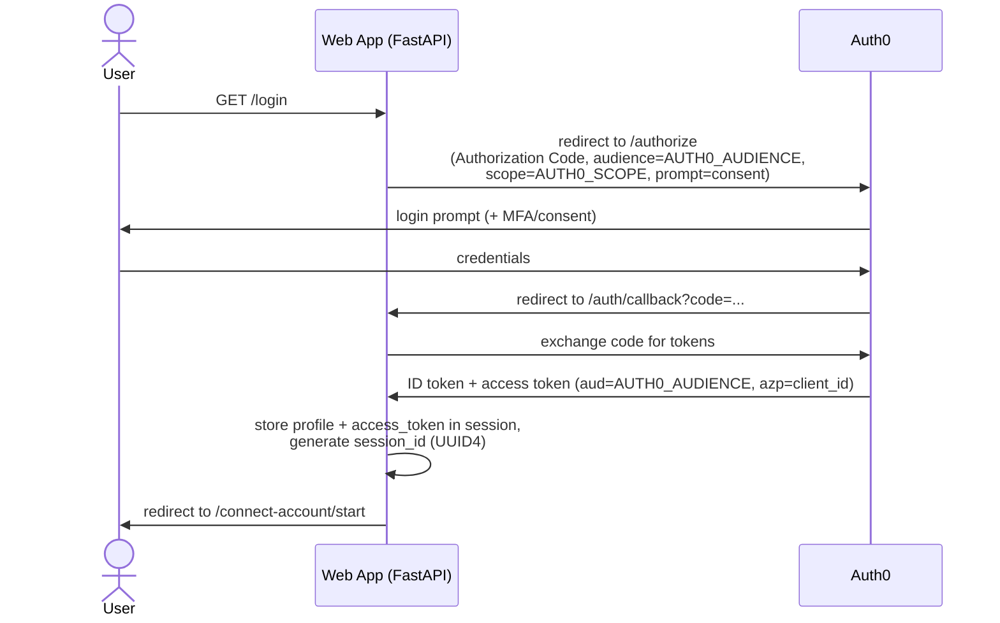
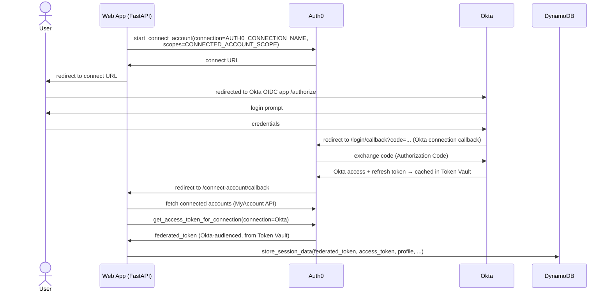
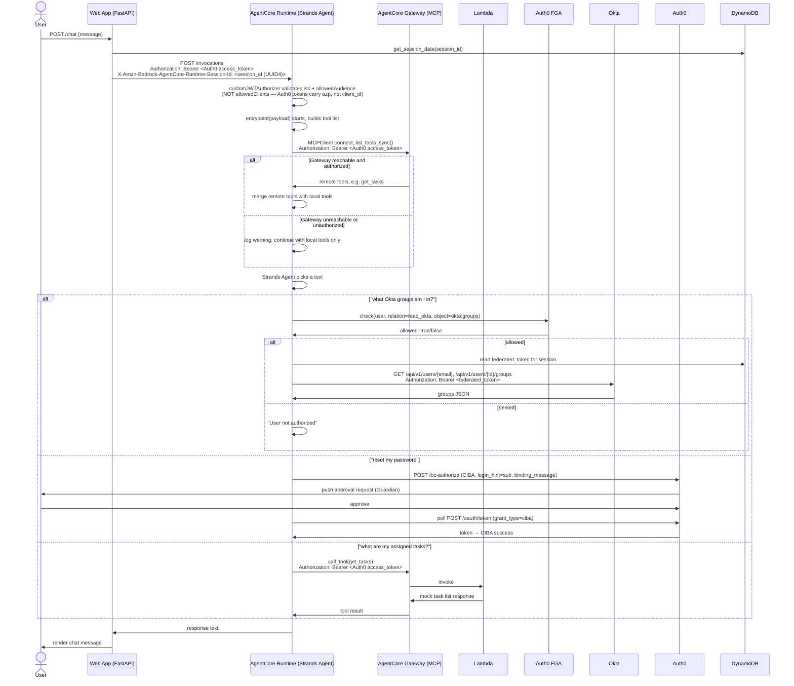

# AgentCore Auth0 Web App

# Setup Guide — Auth0-Secured Agent on AWS Bedrock AgentCore

This is the working setup guide for this repo. It follows the
structure of Auth0's blog post [Securing Amazon Bedrock AgentCore Agents with Auth0
for AI Agents](https://auth0.com/blog/securing-amazon-bedrock-agentcore-agents-auth0-for-ai-agents/)
but corrects a number of gaps, bugs, assumptions and outdated instructions found while following the original instructions. All fixes including setup instructions are contained within this repo. For the full chronological account of *why* each correction below exists, see
[`docs/se-notes.md`](docs/se-notes.md), but this document only gives you the distilled,
actionable version required to get things running for the APJ SE Summit.

## 1. Introduction / Solution Overview

This lab demonstrates an AI agent, hosted on AWS Bedrock AgentCore Runtime, that acts
on a user's behalf against a third-party identity system (Okta) — with every hop
governed by Auth0. A user logs into a FastAPI web app via Auth0. The web app then
walks the user through Auth0's **Connected Accounts** flow (backed by **Token Vault**),
which links the user's Auth0 identity to their Okta account and caches a delegated
Okta access token — the agent never sees the user's Okta password, and never holds a
long-lived standing credential of its own. When the user chats with the agent, the web
app calls the AgentCore Runtime with the user's own Auth0 access token as a bearer
credential; the Runtime's `customJWTAuthorizer` validates that token before the request
ever reaches the agent process. Inside the agent (a Strands Agent), every sensitive
action is gated: reading Okta group membership is preceded by a fine-grained
authorization check against **Auth0 FGA** (a relationship-based, Zanzibar-style
authorization model), and resetting a password requires **step-up authentication** via
**CIBA** (Client-Initiated Backchannel Authentication) — a push approval to the user's
own device, independent of the chat session.

Separately, the agent also acts as an MCP client against an
**AWS Bedrock AgentCore Gateway** (this would be swapped out later for an Auth0 Agent Gateway when available), to centralise tools and enalbe dynamic requests of them at run 
time rather than as a directly-coded within individual clients. In this lab, the Gateway's only target
is a plain **AWS Lambda function**, wrapped via the Gateway's "Lambda ARN" target type
and a Target Schema — it's a deliberately lightweight mock (a hardcoded "list my
assigned tasks" response), not a real backend service, and not a genuine MCP server
implementation itself. What the Gateway adds is discoverability and a standard MCP
interface on top of that Lambda: from the agent's point of view it's just another MCP
tool, callable the same way a real one would be. The Gateway enforces its own inbound
authorization — a JWT authorizer configured separately from, but parallel to, the
Runtime's own — and the agent authenticates to it using the same Auth0 access token
used everywhere else in this flow. This is a real part of the lab, not an optional
extra: it's what lets the agent unify directly-coded tools with dynamically-discovered
remote tools behind one interface, and Section 5.10 covers setting it up.

The point of the lab is the delegation chain: Auth0 login → Auth0 Token Vault → Okta
API, and Auth0 login → AWS AgentCore Runtime → Strands Agent → Auth0 FGA → Okta API /
CIBA, and Auth0 login → AWS AgentCore Runtime → Strands Agent → AWS AgentCore Gateway
(MCP) → Lambda, all governed by short-lived, audience-scoped tokens rather than static
credentials.

## 2. Flow Diagrams

### 2a. Login to the web app



### 2b. Connected Accounts (Token Vault) — linking Okta



### 2c. Chat — agent invocation, Gateway/MCP tool discovery, FGA check, Okta call / CIBA



## 3. Prerequisites

### Accounts / environments (four, all separate)

1. **Okta org** — a Workforce (starter) template org, not a generic Okta Developer
   org. `getOktaGroups` calls Okta's native Users/Groups API directly, so you need at
   least one test user with real group memberships.
2. **Auth0 tenant** — handles login, Token Vault/Connected Accounts, CIBA, and issues
   the JWTs the AgentCore `customJWTAuthorizer` validates.
3. **Okta TDI Provided AWS account** — Bedrock model access, AgentCore Runtime, ECR, DynamoDB. SSO-based
   access (via `aws configure sso` / `aws sso login`) is sufficient and is what the
   deploy script expects — no IAM User / static access keys needed.
4. **Auth0 FGA store** — a separate product/account from the Auth0 tenant
   (`dashboard.fga.dev`), used for the fine-grained authorization check.

### Tooling

- **laptop working environment**
  - I assume and have only tested on MacOS, if you're doing this on a Windows laptop I wish you luck :')
  - Visual Studio code would provide the most integrated working environment as you will be editing files, running scripts, etc
  - Claude code through Lite LLM will be helpful for troubleshooting
- **git**
  - Check: `git --version`.
  - Install: comes with Xcode Command Line Tools (`xcode-select --install`), or via
    Homebrew: `brew install git`.
  - Upgrade: `brew upgrade git` (if installed via Homebrew).

- **Python 3**
  - In a Terminal window:
    - `brew install python@3.12`
    - `echo 'export PATH="/opt/homebrew/opt/python@3.12/bin:$PATH"' >> ~/.zshrc`
    - `source ~/.zshrc`

- **AWS CLI v2**
  - Check: `aws --version` — confirm it reports `aws-cli/2.x`, not `1.x`. This lab's
    scripts and steps use `aws configure sso`, `aws sso login`,
    `aws sts get-caller-identity`, and `aws bedrock list-inference-profiles`, all of
    which require v2.
  - Install: `brew install awscli`, or the
    [official AWS installer](https://docs.aws.amazon.com/cli/latest/userguide/getting-started-install.html).
  - Upgrade (v2.x → v2.y): `brew upgrade awscli`, or re-run the official installer.
  - If you have v1 installed: AWS's own migration docs recommend uninstalling v1
    before installing v2, rather than upgrading in place — both versions use the same
    `aws` command name, so if you install v2 without removing v1 first, whichever one
    is earlier on your `PATH` silently wins. Via Homebrew, `brew uninstall awscli`
    followed by `brew install awscli` handles this cleanly; with the official
    installer, uninstall v1 per its docs, confirm `aws --version` reports nothing,
    then install v2.

- **Auth0 CLI** (`auth0` command)
  - Check: `auth0 --version`.
  - Install: `brew tap auth0/auth0-cli && brew install auth0-cli`.
  - Upgrade: `brew upgrade auth0-cli`.
  - Authenticate (required before the Management-API-backed steps in Section 5, e.g.
    the MRRT policy update via `auth0 apps update`): `auth0 login`, which walks you
    through a device-code flow in your browser against your tenant.

## 4. Areas to Look Out For

This section is about small, easily-missed details in the *manual* setup steps below —
dashboard clicks, Management API calls, and env var values you have to get right
yourself.

### Okta configuration

- **`OKTA_DOMAIN` must be the bare base org domain** (`<org>.okta.com`), never the
  `-admin` console hostname (`<org>-admin.okta.com`). Hitting `/api/v1/...` against the
  `-admin` host returns a **403 with an empty body** — this looks like a permissions
  problem but is actually Okta's edge blocking an unsupported hostname/path
  combination.

### Getting `okta.users.read` onto the federated token (two settings, both required)

`getOktaGroups` calls Okta's Users/Groups Management API, which needs the `okta.users.read`
scope on the federated token Connected Accounts hands you. Getting this scope onto that
token requires **two separate settings to both be correct** (both are set during the
Auth0 tenant setup steps in Section 5.3 — this is just the "why," so you recognize the
symptom if you skip or mis-order either one):

1. The Okta connection's own default scope (set when you create the connection).
2. `CONNECTED_ACCOUNT_SCOPE` in `chatWebApp/.env` (already defaults to the right value in
   `chatWebApp/env.template` — see Section 5.3).

**Symptom if only (1) is missing**: the My Account API rejects the Connect Account
request outright with `Custom scopes are not allowed for this request`. **Symptom if
only (2) is missing**: Connect Account succeeds, but the resulting token silently lacks
the scope — `getOktaGroups` later 403s with:
```
WWW-Authenticate: Bearer ... scope="okta.users.read", error="insufficient_scope",
error_description="The access token provided does not contain the required scopes."
```
Either way, after fixing both, you must **re-run Connect Account** (log out, log back in,
let it re-trigger, or click through it again) — an already-connected account's cached
token doesn't retroactively pick up a scope change; it only takes effect on re-authorization.

### Bedrock model availability

Whatever `BEDROCK_MODEL_ID` ships as a default in `agentCoreDeployment/env.sample` will not
necessarily be available in your own AWS account/region by the time you read this —
Bedrock model IDs and cross-region inference profiles change over time (new ones added,
old ones deprecated). Check the Bedrock console's model catalog (or
`aws bedrock list-inference-profiles --region <region>`) for a currently-live Claude
profile ID before deploying; don't assume the default in the env file is still correct.
There's also a separate, account-level "model use case" gate in the AWS/Anthropic
console that can block a model even when it isn't deprecated — if you get a
"Model use case details have not been submitted" error, that's this, not a deprecation
issue. Leaving `BEDROCK_MODEL_ID` blank in `.env` still counts as "set" (an empty
string), so it will not fall through to any code-level default — it must be a real
value.

## 5. Step-by-Step Instructions

Before starting here, ensure you have all the required tools and environments setup as outlined above in Section 3

### 5.1 Clone and inspect

```bash
git clone <this-repo-url> agentcore-auth0-webapp
cd agentcore-auth0-webapp
```

Two independent apps live here: `chatWebApp/`, the FastAPI web app, and
`agentCoreDeployment/`, the AgentCore agent + its deploy script.
There is also a `infrastructure` folder which contains all the required AWS CloudFormation assets to automate their deployment.

1. Copy the file `chatWebApp/env.template` into a new file called `chatWebApp/.env`. Throughout this setup guide, **"Web App .env"** means this .env file you just created and it is used for the WebApp client.
2. Copy the file `agentCoreDeployment/env.template` into `agentCoreDeployment/.env`. Throughout this setup guide, **"AgentCore Deployment .env"** means thins env file and is used by the AgentCore agent itself.

For all future steps, whenever a step produces
a value needed in either one of these files, the doc tells you which file it goes into and under which variable name. Be sure to cut and paste them immediately.

### 5.2 Okta org setup

1. Create/use a Workforce (starter) org and go to the okta Admin Console
   - Admin Console --> Directory --> Groups, Create two groups: **Okta Group 1** and **Okta Group 2**.
   - Under Admin Console --> Directory --> Perople, Create a new Okta user by clicking on the **Add person** button. Give them an email address you will **reuse for the Auth0
     user you create later** (end of Section 5.3) — the FGA tuple, the Okta group
     membership, and the Auth0 identity all need to line up on the same email address
     for the demo to work end to end. Select to **Activate now**, Set a password that you will remember and uncheck **User must change password on first login**. Press the **Save** button.
  -  If the new Person does not show up on the People screen, refresh the page, then click on the Name of the new User you've just created. Select the **Admin roles** tab, click on the **Add individual admin privileges** button, in the **Role** drop down, search for the **Super Administrator** role, and click **Save Changes**.
  **-- NOTE --** Giving users Super Administrator permissions is NOT best practice and is being done to speed up configuration of this lab.
   - On the user profile record, go to the **Groups** tabs and assign the user you just created to **Okta Group 2 only** — leave them out of Okta
     Group 1. This is what `getOktaGroups` returns later, and gives you a group you can
     use to demonstrate access via FGA vs. one you can't.
2. Okta Admin Console → Applications → Create App Integration → **OIDC – OpenID Connect**, Application Type **Web Application**, App integration name **`SESummitLabApp`**.
3. Enable Grant type - core grants **Authorization Code & Refresh Token**

4. Leave the **Sign-in redirect URI** blank for now, it will take the shape of `https://{AUTH0_DOMAIN}/login/callback`, also leave the **Sign-out redirect URI's** blank for now, it will take the shape of `https://{AUTH0_DOMAIN}/logout`. Once you know your Auth0 domain (step 5.3.1) come back and update these fields.

5. In Assignments select **Allow everyone in your organization to access**, and press the **Save** button. 

6. In the Client Credentials section, copy and temporarily save the **Client ID** as well as within the CLIENT SECRETS section, copy and temporarily save the **Client Secret**.
   - Client ID & Client Secret get pasted directly into the Auth0 enterprise connection you'll
     create in 5.3.3 — they don't go into either `.env` file, so be sure to save them somewhere safe for now.
7. Note your org's base domain — `<org>.okta.com` and remove any `-admin` if present in the URL. For example, the domain `demo-peach-salmon-30608-admin.okta.com` would translate to a base domain of `demo-peach-salmon-30608.okta.com`
   - The bare domain goes into **AgentCore Deployment .env** as `OKTA_DOMAIN`.

8. On the **Okta API Scopes** tab of the **`SESummitLabApp`** app, grant scopes:
  - okta.groups.read
  - okta.users.read


### 5.3 Auth0 tenant setup

1. **Auth0 Guardian Setup** Auth0 Dashboard → Security → Multi-factor Auth. Ensure `Push Notification using Auth0 Guardian` is Enabled.
  - Pre-enroll the user you've just setup with Guardian by going to Auth0 Dashboard → User Management → Users, and selecting the user you've just created. Find the **Multi-Factor Authentication** section and click on the **Send en emrollment invitation**
2. Create an **Application**: Applications → Create Application → Regular Web Application. Name
   it `AgentCoreLabWebApp`.
   - **Callback URLs**: `http://127.0.0.1:5000/auth/callback`,`http://127.0.0.1:5000/connect-account/callback`
   - **Allowed Logout URLs**: `http://127.0.0.1:5000/logout`
   - **Allowed Web Origins**: `http://127.0.0.1`
   - Copy **Domain**, **Client ID**, **Client Secret** from this application's Settings
     tab → put into **both** `.env` files:
     - **Web App .env**: `AUTH0_DOMAIN`, `AUTH0_CLIENT_ID`, `AUTH0_CLIENT_SECRET`
     - **AgentCore Deployment .env**: `AUTH0_DOMAIN`, `AUTH0_CLIENT_ID`, `AUTH0_CLIENT_SECRET`
   - Scroll down to this same application's **Advanced Settings** → **Grant Types**
     tab → check **Token Vault**, **Refresh Token**, **Client Initiated Backchannel Authentication (CIBA)**.
   - Just above Advanced Settings, in the **Client-Initiated Backchannel Authentication (CIBA)** section, there will be a **Notification Channels**, enable **Guardian Push**
3. Create a **Custom API**: Applications → APIs → Create API.:
    - Name: `SESummitAPI`
    - Identifier (the `aud` claim): `https://agentcore-lab-api` - This matches the default already in `chatWebApp/env.template` and `agentCoreDeployment/env.sample`.  This is the API that is specified in the `AUTH0_AUDIENCE` .env variable in both the **Web App .env** and **AgentCore Deployment .env**, verify those are both set to `https://agentcore-lab-api` within those files.
    - Press **Create**
    - Go to the **Settings** tab, scroll down to Access Settings and enable `Allow Offline Access`, press **Save**
4. Create an **Enterprise connection** to your Okta org: Authentication → Enterprise → OpenID Connect → **Create** button
   connection. Create it as an OIDC-based Enterprise Connection within your Auth0
   tenant, named exactly `okta-agentcore`.
   - **Purpose** `Authentication and Connected Accounts for Token Vault`
   - **General** Connection Name: `okta-agentcore`
   - **OpenID Connect Discovery URL** `https://{your-okta-domain}/.well-known/openid-configuration`.
   - **Client ID** from the Okta OIDC app created in 5.2.
   - **Communication Channel** Back Channel
   - **Authentication Method** Client Secret from the Okta OIDC app created in 5.2.
   - Copy the **Callback URL** and **Logout URL** and enter them in the **Sign-in** and **Sign-out** redirect URI fields within the Okta Integrated App you created in step 5.2.4
   - Press **Create**
   - Back on API detail page, select the **Settings** tab and in **General** -> **Scopes** add `offline_access okta.users.read okta.groups.read` (Token Vault needs a refresh token to redeem later).
   - On the **Login Experience** tab, ensure `Display connection as a button` is checked and press **Save**
   - On the **Applications** tab → confirm `AgentCoreLabWebApp` is enabled.   

5. Enable and setup the **MyAccount API**: Auth0 Dashboard → **Applications** → **APIs**, click the **Activate** button in the **My Account API** notification box at the top of the screen (if it is not there, then you may have already activated it)
  - That will create a new API called **Auth0 My Account API**, click on the API name to navigate to the API detail page:
  - On the **Settings** tab, turn off `Require 2FA`
  - On the **Settings** tab, in the **Access Settings** section turn on **Allow Skipping User Consent**
  - On the **Applications** tab, grant all User-delegated Access permissions for the `AgentCoreLabWebApp` app. 

6. Configure **MRRT (Multi-Resource Refresh Token) policy**: Back in **Applications**, go to the `AgentCoreLabWebApp`
   application page, scroll down to **Multi-Resource Refresh Token**, and click **Edit Configuration**. Enable it for **both** the `Auth0 My Account API` and `SESummitAPI`.
   This is what lets a single refresh token obtained at
   login be exchanged for both audiences later — without it, exchanging for the
   MyAccount API audience silently falls back to the original login audience instead of
   erroring.
7. **Create a matching Auth0 user**: Auth0 Dashboard → User Management → Users →
   Create User, using the **same email address** as the Okta user you created in 5.2.1.
   The FGA tuple (created in step 5.4.3), the Okta group membership (created in step 5.2.1), and this Auth0 user all
   need to share that one email address for the demo to work end to end.

### 5.4 Auth0 FGA store setup

1. Using your okta email address, login to `dashboard.fga.dev`. I this is your first time logging in or you have existing models you'd like to save, select **+ Add new store** and name it `SESummitAILab`, click **Finish**. Click on **Model Explorer**
2. On the Model Explorer page, within the Model box, paste exactly:
   ```
   model
     schema 1.1

   type user

   type group
     relations
       define member: [user]

   type okta
     relations
       define read_okta: [user, group#member]
   ```
   and press **Save**
3. From the left menu, select **Tuple Management** and create the authorization tuple by clicking on the **+ Add Tuple** button.
   - User: `user:<your-test-user's-email>`
   - Object: `okta` Enter ID: `groups`
   - Relation: `read_okta`
   > **This must be the same email address** as the Okta user and the Auth0
   > user — all three need to line up on one email for the demo to work.

4. In the left hand menu, go to **Store Settings** scroll to the **Authorized Clients** section towards the bottom of the page.
- Click the **+ Create Client** button
- **Client Name** `SESummitAgent`
- Under **Client Permissions** check:
    - **Read/Write model, changes, and assertions**
    - **Write and delete tuples**
    - **Read and query**.
- Click **Create**
- Save the resulting Store ID, Client ID and Client Secret in **AgentCore Deployment .env** in the files `FGA_STORE_ID`, `FGA_CLIENT_ID` and `FGA_CLIENT_SECRET` respecitvely. Click **Continue**
- Select the **CURL** tab from the modal window and copy the top variables `FGA_API_URL` `FGA_STORE_ID` `FGA_MODEL_ID` `FGA_API_TOKEN_ISSUER` `FGA_API_AUDIENCE` `FGA_CLIENT_ID` `FGA_CLIENT_SECRET` and paste over the same variables in the **AgentCore Deployment .env** file.

### 5.5 AWS setup

This lab uses Okta-provided AWS sandbox accounts that only support SSO-based access —
there are no long-lived IAM access keys anywhere in this lab. Every AWS-touching step
here, the local deploy script, and the web app's own DynamoDB access, authenticates
via an AWS SSO profile rather than static credentials.

1. In your local terminal **Run `aws configure sso`** — one-time setup. This prompts for your SSO start URL and SSO 
   region which you can get by going to your Okta Dashboard (https://okta.okta.com), search for AWS and select "AWS Corp: Business Technology". Expand the AWS account named similar to "okta-bt-gtm-<your okta username>" and click on the "Access keys" link. From there you can copy and paste the **SSO Start URL**, **SSO Region**. It will prompt you for:

   - **SSO Session name**: `APJSESummit`
   - **SSO start URL**: cut and paste from AWS access portal
   - **SSO region**: cut and paste from AWS access portal
   - **SSO registration scopes**: accept detfault
   - It will pop out to a browser window asking you to grant access to botocore-client-APJSESummit, press `Allow access`
   - Back in terminal, if you have multiple AWS Account, it will ask you to select which one you'd like to use, select okta-bt-gtm-<your user name>
   - **Default client Region**: accept default
   - **CLI default output format**: accept default
   - **Profile name**: accept default
   - It will show you your profile name which should be similar to `GTMUser-<bunch of numbers>`, copy that profile name into the variable called `AWS_PROFILE` in **both** the **Web App .env** and the **AgentCore Deployment .env**.

2. In your local terminal **Run `./deployInfra`** — this
   is and automated via CloudFormation and creates
   three things in one run: the DynamoDB session table, the agent's
   execution role with its DynamoDB policy already attached and the mock Lambda + AgentCore Gateway + GatewayTarget.
   - This script will prompt you for your `AWS_PROFILE`, `AUTH0_DOMAIN` and
     `AUTH0_CLIENT_ID`

   - At the end it prints `AGENT_EXECUTION_ROLE_ARN`, and
     `MCP_GATEWAY_URL` copy these into your **AgentCore Deployment .env** replacing the existing variables.

### 5.6 Deploy the agent
In your local terminal run:

```bash
./deployAgentCore
```

This checks the AWS SSO session for `AWS_PROFILE` (5.5.1), creates `agentCoreDeployment/.venv` on first run, installs
`agentCoreDeployment/requirements.txt`, and runs `agentcore_deployment.py`, which will prints `AGENT_RUNTIME_ARN: <arn>` when it finshes successfully.

**Copy this** into `chatWebApp/.env`'s `AGENT_RUNTIME_ARN`

### 5.9 Run the web app

Start the web app in a terminal window by running:
```bash
./runLocalApp
```

Open your web browser and navigate to (http://127.0.0.1:5000).
You can stop your web app within the termain by pressing `ctrl + c`

### 5.10 Test the flow

1. Open `http://127.0.0.1:5000`, click login. Complete Auth0 login (expect MFA/consent
   per your tenant policy).
2. You'll be redirected into the Connect Account flow automatically — approve the Okta
   login when prompted. On success you land on `/chat` with the connected-account
   status shown.
3. Ask: *"what Okta groups am I part of?"* — expect the FGA check to pass (confirm via
   agent logs: `FGA response: ... 'allowed': True`), then a real group list back from
   Okta. 
4. Ask for a password reset (e.g. *"reset my password"*) to exercise the CIBA path —
   expect a push-approval prompt on the user's registered device; approving it should
   return a success message from the agent.

If anything above doesn't work as described, see Section 6, Troubleshooting.

## 6. Troubleshooting Tips

### Okta `-admin` domain — 403 with an empty body

If `OKTA_DOMAIN` (5.2.5) ends up set to the `-admin` console hostname
(`<org>-admin.okta.com`) instead of the bare base domain (`<org>.okta.com`), calls to
`/api/v1/...` return a **403 with an empty body**. This looks like a permissions
problem but isn't one — it's Okta's edge blocking an unsupported hostname/path
combination before the request ever reaches Okta's application logic. A genuine
Okta API-level 403 comes back with a JSON error body (e.g.
`{"errorCode":"E0000006",...}`); an *empty* body on a 403 is the tell that the
hostname itself is wrong. Fix: remove `-admin` from `OKTA_DOMAIN`, redeploy.

### MRRT policy not taking effect

After setting up MRRT (5.3.5) and running through Connect Account at least once,
verify it actually took effect: Auth0 Dashboard → Monitoring → Logs, filter for
`type: sertft` ("Successful Refresh Token exchange"), and check that
`details.policy_used == "mrrt"` in the matching log entry, with the `audience`/`scope`
fields matching what was actually requested (not the original login audience). If
`policy_used` isn't `mrrt`, or the audience looks like it silently fell back to the
login audience instead of erroring, the policy isn't configured correctly yet —
Auth0 doesn't raise an explicit error for this, it just silently uses the wrong
audience/scope, so this log check is the only reliable way to confirm it.

### Bedrock model unavailable or deprecated

If deploying fails with a model-related error, first confirm the model ID is actually
live in your account/region:
```bash
aws bedrock list-inference-profiles --region us-west-2
```
The default `BEDROCK_MODEL_ID=global.anthropic.claude-sonnet-5` should broadly work,
but Bedrock model IDs and cross-region inference profiles change over time — don't
assume the default is still correct by the time you read this. See Section 4, "Bedrock
model availability," for the separate account-level "model use case" gate that can
also block a model even when it isn't deprecated.

### 401 / 500 errors invoking the agent

If you get a **401** invoking the agent, check, in order:
1. `allowedClients` isn't set in the `customJWTAuthorizer` config (Auth0 tokens carry
   `azp`, not `client_id` — `allowedClients` can never match).
2. `runtimeSessionId` is ≥ 33 characters (this repo's own `session_id` UUID4 already
   satisfies this — only relevant if you've changed that code).
3. The DynamoDB IAM policy is attached to the execution role named in
   `AGENT_EXECUTION_ROLE_ARN` (created by `./deployInfra`, 5.5.2/5.8) — check
   `infrastructure/templates/02-agent-execution-role.yaml` deployed cleanly.

If you get a **500** from inside the container, check CloudWatch under
`/aws/bedrock-agentcore/runtimes/<agent_id>-<endpoint_name>` — the `[runtime-logs]`
stream shows the actual Python traceback.

### Python version mismatches in `deployAgentCore`/`runLocalApp`

Both scripts resolve a `BASE_PYTHON` (preferring Homebrew's `python3.12`, falling back
through `3.11`/`3.10`/system `python3`) and only create `.venv` from it if `.venv`
doesn't already exist yet. If you previously ran either script, then later
installed/upgraded your Python (e.g. via Homebrew), the script won't notice — it reuses
the existing `.venv`, still built from the *old* interpreter, silently. Symptoms look
like version-related import errors or unexpected package behavior that don't match
what you'd expect from your currently-installed Python.

Fix: delete the stale venv and let the script rebuild it from the current
`BASE_PYTHON` on the next run —
```bash
rm -rf agentCoreDeployment/.venv   # for deployAgentCore
rm -rf chatWebApp/.venv            # for runLocalApp
```
No code change needed; this is a one-time cleanup, not a recurring step.


## 7. Environment Variable Reference

### AgentCore Deployment .env

Copy `agentCoreDeployment/env.template` → `agentCoreDeployment/.env`. Its defaults are already the correct values for this lab — only the tenant/account-specific fields below need
filling in; leave everything else as shipped:

| Var | Source |
|---|---|
| `AWS_PROFILE` | your `aws configure sso` profile name from 5.5.1 |
| `AWS_DEFAULT_REGION` | leave `us-west-2` unless deploying elsewhere |
| `AUTH0_DOMAIN` | your Auth0 tenant domain (bare, no scheme) |
| `AUTH0_CLIENT_ID` / `AUTH0_CLIENT_SECRET` | the `AgentCoreLabWebApp` app from 5.3.1 (also reused for CIBA) |
| `AUTH0_AUDIENCE` | leave `https://agentcore-lab-api` — must exactly match the Web App .env value and the API identifier from 5.3.2 |
| `SESSION_TABLE_NAME` | leave `agentcore-lab-sessions` — must exactly match the Web App .env value |
| `CIBA_SCOPE` / `CIBA_BINDING_MESSAGE` | leave the defaults, or customize the binding message shown on the user's push-approval device |
| `FGA_API_URL`, `FGA_STORE_ID`, `FGA_MODEL_ID`, `FGA_API_TOKEN_ISSUER`, `FGA_API_AUDIENCE`, `FGA_CLIENT_ID`, `FGA_CLIENT_SECRET` | your FGA store's config output, 5.4.4/5.4.5 |
| `FGA_API_SCHEME` | leave `https` |
| `AGENT_EXECUTION_ROLE_ARN` | `ExecutionRoleArn` output from `./infrastructure/deployInfra`, 5.5.2 |
| `MCP_GATEWAY_URL` | `GatewayUrl` output from `./infrastructure/deployInfra`, 5.5.2 |
| `OKTA_DOMAIN` | bare Okta org domain from 5.2.5 — **not** the `-admin` host |
| `BEDROCK_MODEL_ID` | `global.anthropic.claude-sonnet-5` by default — confirm it's still live before deploying (Section 6) |

### Web App .env

Copy `chatWebApp/env.template` → `chatWebApp/.env`. As with the AgentCore Deployment .env, the defaults are already correct for this lab:

| Var | Source |
|---|---|
| `APP_SECRET_KEY` | generate your own: `python3 -c "import secrets; print(secrets.token_hex(32))"` |
| `AUTH0_CLIENT_ID` / `AUTH0_CLIENT_SECRET` / `AUTH0_DOMAIN` | same Auth0 app as 5.3.1 |
| `AUTH0_AUDIENCE` | leave `https://agentcore-lab-api` — same value as the AgentCore Deployment .env |
| `AUTH0_SCOPE` | leave the default — must include `create:me:connected_accounts`, already the case in `chatWebApp/env.template` |
| `CONNECTED_ACCOUNT_SCOPE` | leave the default (`openid profile email offline_access okta.users.read`) — only works once the connection's own default scope also includes `okta.users.read` (5.3.3) |
| `AUTH0_CONNECTION_NAME` | leave `okta-agentcore` — matches the connection Name you set in 5.3.3 |
| `AWS_PROFILE` | same SSO profile name as the AgentCore Deployment .env (5.5.1) |
| `AWS_REGION` | leave `us-west-2` — same region as your DynamoDB table / deploy region |
| `AGENT_RUNTIME_ARN` | filled in after deploy (5.8) |
| `SESSION_TABLE_NAME` | leave `agentcore-lab-sessions` — same value as the AgentCore Deployment .env |

There are no `AWS_ACCESS_KEY_ID`/`AWS_SECRET_ACCESS_KEY`/`AWS_SESSION_TOKEN` vars here —
the web app's DynamoDB access goes through the same `AWS_PROFILE` SSO session not static credentials.
