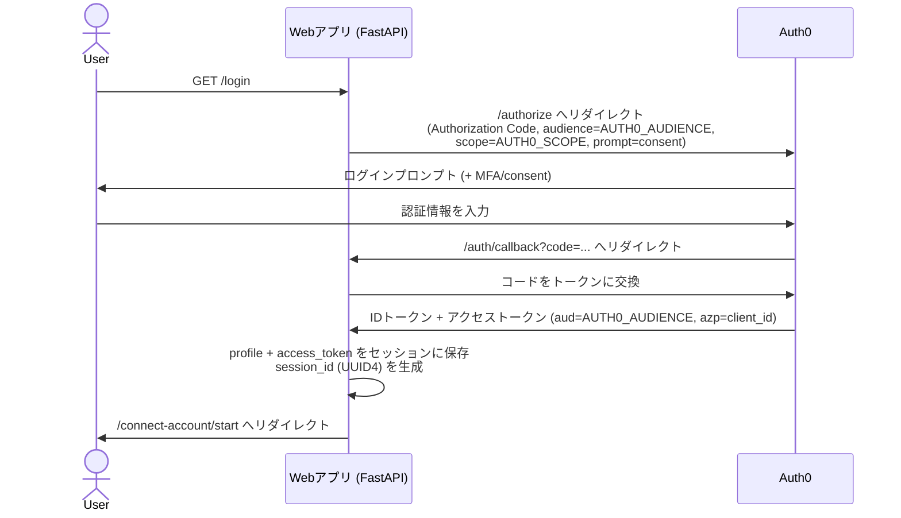
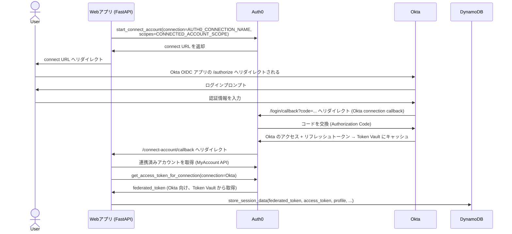
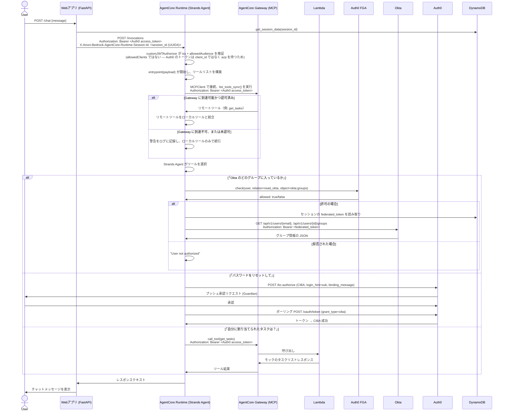

# AgentCore Auth0 Web App

# セットアップガイド — AWS Bedrock AgentCore 上の Auth0 で保護されたエージェント

本ドキュメントは、このリポジトリの実用的なセットアップガイドです。Auth0 のブログ記事 [Securing Amazon Bedrock AgentCore Agents with Auth0
for AI Agents](https://auth0.com/blog/securing-amazon-bedrock-agentcore-agents-auth0-for-ai-agents/) の構成に従っていますが、元の手順に従う中で見つかった数々のギャップ、バグ、前提条件の誤り、古くなった手順を修正しています。セットアップ手順を含むすべての修正は、このリポジトリ内に収められています。以下の各修正が*なぜ*存在するのかについての完全な時系列の経緯は
[`docs/se-notes.md`](docs/se-notes.md) を参照してください。ただし、本ドキュメントは APJ SE Summit で実際に動かすために必要な、要点を絞った実践的なバージョンのみを提供します。

## 1. はじめに / ソリューション概要

この Lab では、AWS Bedrock AgentCore Runtime 上でホストされた AI エージェントが、ユーザーに代わってサードパーティの ID システム（Okta）に対して操作を行う様子を示します。すべてのホップは Auth0 によって統制されています。ユーザーは Auth0 経由で FastAPI の Web アプリにログインします。Web アプリはその後、ユーザーを Auth0 の **Connected Accounts** フロー（**Token Vault** に支えられています）に導き、ユーザーの Auth0 アイデンティティを Okta アカウントに紐づけて、委任された Okta アクセストークンをキャッシュします。エージェントはユーザーの Okta パスワードを一切見ることがなく、自身で長期間有効な常設クレデンシャルを保持することもありません。ユーザーがエージェントとチャットすると、Web アプリはユーザー自身の Auth0 アクセストークンをベアラークレデンシャルとして AgentCore Runtime を呼び出します。Runtime の `customJWTAuthorizer` は、リクエストがエージェントのプロセスに到達する前にそのトークンを検証します。エージェント内部（Strands Agent）では、機微な操作はすべてゲートされています。Okta のグループメンバーシップを読み取る前には **Auth0 FGA**（関係ベースの Zanzibar 型認可モデル）に対するきめ細かい認可チェックが行われ、パスワードのリセットには **CIBA**（Client-Initiated Backchannel Authentication）による **step-up 認証** — チャットセッションとは独立した、ユーザー自身のデバイスへのプッシュ承認 — が必要です。

これとは別に、エージェントは **AWS Bedrock AgentCore Gateway** に対する MCP クライアントとしても動作します（これは将来、利用可能になれば Auth0 Agent Gateway に置き換えられる想定です）。目的は、個々のクライアントに直接コーディングするのではなく、ツールを一元化し、実行時に動的にリクエストできるようにすることです。この Lab では、Gateway のターゲットは単純な **AWS Lambda function** 一つだけで、Gateway の "Lambda ARN" ターゲットタイプと Target Schema を介してラップされています。これは意図的に軽量なモック（ハードコードされた「自分に割り当てられたタスクを一覧表示する」レスポンス）であり、実際のバックエンドサービスでもなければ、本物の MCP サーバー実装そのものでもありません。Gateway が追加するのは、その Lambda の上に載せられたディスカバラビリティと標準的な MCP インターフェースです。エージェントの視点からは、それは本物のツールと同じように呼び出せる、単なる別の MCP ツールに見えます。Gateway は自身のインバウンド認可を強制します — Runtime 自身のものとは別に設定されつつ並行して機能する JWT authorizer です — そしてエージェントは、このフローの他の場所で使われているのと同じ Auth0 アクセストークンを使って Gateway に対して認証を行います。これは Lab の本質的な一部であり、任意のオプションではありません。エージェントが、直接コーディングされたツールと動的に発見されたリモートツールを一つのインターフェースの背後に統合できるのはこの仕組みのおかげであり、その設定方法は Section 5.10 で説明します。

この Lab の要点は、委任チェーンにあります。Auth0 login → Auth0 Token Vault → Okta API、そして Auth0 login → AWS AgentCore Runtime → Strands Agent → Auth0 FGA → Okta API / CIBA、そして Auth0 login → AWS AgentCore Runtime → Strands Agent → AWS AgentCore Gateway (MCP) → Lambda。これらすべてが、静的なクレデンシャルではなく、短命でオーディエンススコープを持つトークンによって統制されています。

## 2. フロー図

### 2a. Web アプリへのログイン



### 2b. Connected Accounts（Token Vault）— Okta の連携



### 2c. チャット — エージェント呼び出し、Gateway/MCP ツールディスカバリ、FGA チェック、Okta 呼び出し / CIBA



## 3. 前提条件

### アカウント / 環境（4つ、すべて別個）

1. **Okta org** — 汎用の Okta Developer org ではなく、Workforce（starter）テンプレートの org。`getOktaGroups` は Okta のネイティブな Users/Groups API を直接呼び出すため、実際のグループメンバーシップを持つテストユーザーが最低1人必要です。
2. **Auth0 tenant** — ログイン、Token Vault/Connected Accounts、CIBA を処理し、AgentCore の `customJWTAuthorizer` が検証する JWT を発行します。
3. **Okta TDI Provided AWS account** — Bedrock モデルアクセス、AgentCore Runtime、ECR、DynamoDB。SSO ベースのアクセス（`aws configure sso` / `aws sso login` 経由）で十分であり、デプロイスクリプトもこれを前提としています — IAM User や静的アクセスキーは不要です。
4. **Auth0 FGA store** — Auth0 tenant とは別のプロダクト/アカウント（`dashboard.fga.dev`）で、きめ細かい認可チェックに使用します。

### ツール

- **ラップトップの作業環境**
  - 前提として MacOS でのみテストしています。Windows ラップトップで行う場合は、頑張ってください :')
  - ファイルの編集やスクリプトの実行などを行うため、Visual Studio Code が最も統合された作業環境になるはずです
  - トラブルシューティングには、Lite LLM 経由の Claude Code が役立ちます
- **git**
  - 確認: `git --version`。
  - インストール: Xcode Command Line Tools（`xcode-select --install`）に付属、または Homebrew 経由で `brew install git`。
  - アップグレード: `brew upgrade git`（Homebrew でインストールした場合）。

- **Python 3**
  - ターミナルウィンドウで:
    - `brew install python@3.12`
    - `echo 'export PATH="/opt/homebrew/opt/python@3.12/bin:$PATH"' >> ~/.zshrc`
    - `source ~/.zshrc`

- **AWS CLI v2**
  - 確認: `aws --version` — `1.x` ではなく `aws-cli/2.x` と表示されることを確認してください。この Lab のスクリプトや手順は `aws configure sso`、`aws sso login`、`aws sts get-caller-identity`、`aws bedrock list-inference-profiles` を使用し、いずれも v2 が必要です。
  - インストール: `brew install awscli`、または [公式 AWS インストーラー](https://docs.aws.amazon.com/cli/latest/userguide/getting-started-install.html)。
  - アップグレード（v2.x → v2.y）: `brew upgrade awscli`、または公式インストーラーを再実行。
  - v1 がインストール済みの場合: AWS 自身の移行ドキュメントでは、そのまま上書きアップグレードするのではなく、v2 をインストールする前に v1 をアンインストールすることを推奨しています — 両バージョンは同じ `aws` コマンド名を使うため、v1 を先に削除せずに v2 をインストールすると、`PATH` 上で先に見つかった方が黙って優先されてしまいます。Homebrew の場合は `brew uninstall awscli` の後に `brew install awscli` を実行すればきれいに解決します。公式インストーラーの場合は、そのドキュメントに従って v1 をアンインストールし、`aws --version` が何も返さないことを確認してから v2 をインストールしてください。

- **Auth0 CLI**（`auth0` コマンド）
  - 確認: `auth0 --version`。
  - インストール: `brew tap auth0/auth0-cli && brew install auth0-cli`。
  - アップグレード: `brew upgrade auth0-cli`。
  - 認証（Section 5 の Management API を使う手順、例えば `auth0 apps update` による MRRT ポリシー更新の前に必要）: `auth0 login` を実行すると、ブラウザ上でテナントに対するデバイスコードフローが案内されます。

## 4. 注意すべきポイント

このセクションでは、以下の*手動*セットアップ手順における、見落としがちな細かい点について説明します — ダッシュボードでのクリック操作、Management API 呼び出し、そして自分で正しく設定する必要がある環境変数の値などです。

### Okta の設定

- **`OKTA_DOMAIN` は素の org ベースドメイン**（`<org>.okta.com`）でなければならず、`-admin` コンソールのホスト名（`<org>-admin.okta.com`）を使ってはいけません。`-admin` ホストに対して `/api/v1/...` を呼び出すと、**空のボディを伴う 403** が返ってきます — これは権限の問題に見えますが、実際には Okta のエッジが未対応のホスト名/パスの組み合わせをブロックしているだけです。

### federated token に `okta.users.read` を付与する（2つの設定、両方必須）

`getOktaGroups` は Okta の Users/Groups Management API を呼び出しますが、これには Connected Accounts が渡してくる federated token に `okta.users.read` スコープが必要です。このスコープをそのトークンに付与するには、**2つの別々の設定が両方とも正しい**必要があります（どちらも Section 5.3 の Auth0 tenant セットアップ手順の中で設定します — ここでは、片方を飛ばしたり順序を間違えたりした場合の症状を見分けられるように「なぜ」を説明するだけです）:

1. Okta connection 自体のデフォルトスコープ（connection 作成時に設定）。
2. `chatWebApp/.env` の `CONNECTED_ACCOUNT_SCOPE`（`chatWebApp/env.template` の中で既に正しい値がデフォルトになっています — Section 5.3 を参照）。

**(1) だけが欠けている場合の症状**: My Account API が Connect Account リクエストを `Custom scopes are not allowed for this request` というエラーで即座に拒否します。**(2) だけが欠けている場合の症状**: Connect Account 自体は成功しますが、得られるトークンには黙ってそのスコープが含まれておらず、後で `getOktaGroups` が以下のような 403 を返します:
```
WWW-Authenticate: Bearer ... scope="okta.users.read", error="insufficient_scope",
error_description="The access token provided does not contain the required scopes."
```
どちらの場合も、両方を修正した後は **Connect Account を再実行**する必要があります（ログアウトして再ログインし、再トリガーさせる、または再度クリックして通す）— 既に連携済みのアカウントのキャッシュされたトークンは、スコープの変更を遡って反映することはなく、再認可のタイミングでのみ有効になります。

### Bedrock モデルの可用性

`agentCoreDeployment/env.sample` にデフォルトとして入っている `BEDROCK_MODEL_ID` が、あなたがこれを読んでいる時点で、自分の AWS アカウント/リージョンで必ずしも利用可能とは限りません — Bedrock のモデル ID やクロスリージョン推論プロファイルは時間の経過とともに変化します（新しいものが追加され、古いものが非推奨になります）。デプロイ前に、Bedrock コンソールのモデルカタログ（または `aws bedrock list-inference-profiles --region <region>`）で、現時点で有効な Claude のプロファイル ID を確認してください。env ファイルのデフォルト値がまだ正しいとは決して思い込まないでください。また、AWS/Anthropic コンソールには、非推奨でなくてもモデルをブロックできる、アカウントレベルの別の「model use case」ゲートがあります — 「Model use case details have not been submitted」というエラーが出た場合は、これが原因であり、非推奨化の問題ではありません。`.env` で `BEDROCK_MODEL_ID` を空にしていても、それは「設定済み」（空文字列）とみなされるため、コード側のデフォルト値にフォールバックすることはありません — 必ず実際の値を設定してください。

## 5. 手順（ステップバイステップ）

ここから始める前に、上記の Section 3 に記載されている必要なツールと環境がすべてセットアップ済みであることを確認してください。

### 5.1 クローンと確認

```bash
git clone <this-repo-url> agentcore-auth0-webapp
cd agentcore-auth0-webapp
```

ここには独立した2つのアプリが存在します。FastAPI の Web アプリである `chatWebApp/` と、AgentCore エージェント本体 + そのデプロイスクリプトである `agentCoreDeployment/` です。さらに、それらのデプロイを自動化するために必要な AWS CloudFormation のアセット一式を含む `infrastructure` フォルダもあります。

1. `chatWebApp/env.template` ファイルをコピーして、`chatWebApp/.env` という新しいファイルを作成します。本セットアップガイドを通じて、**「Web App .env」** とは、今作成したこの .env ファイルを指し、WebApp クライアントで使用されます。
2. `agentCoreDeployment/env.template` ファイルをコピーして `agentCoreDeployment/.env` を作成します。本セットアップガイドを通じて、**「AgentCore Deployment .env」** とは、この env ファイルを指し、AgentCore エージェント自体が使用します。

以降のすべての手順で、ある手順がこれら2つのファイルのどちらかに必要な値を生成した場合、本ドキュメントはそれをどちらのファイルに、どの変数名で入れるべきかを示します。値が得られたら、すぐにコピー&ペーストしてください。

### 5.2 Okta org のセットアップ

1. Workforce（starter）org を作成、または既存のものを使用し、Okta の Admin Console に移動します。
   - Admin Console --> Directory --> Groups で、2つのグループを作成します: **Okta Group 1** と **Okta Group 2**。
   - Admin Console --> Directory --> People で、**Add person** ボタンをクリックして新しい Okta ユーザーを作成します。このユーザーには、後で作成する **Auth0 ユーザーで再利用するメールアドレス**（Section 5.3 の末尾）を設定してください — デモがエンドツーエンドで動作するには、FGA タプル、Okta のグループメンバーシップ、Auth0 のアイデンティティがすべて同じメールアドレスで揃っている必要があります。**Activate now** を選択し、覚えておけるパスワードを設定して、**User must change password on first login** のチェックを外します。**Save** ボタンを押します。
   - 新しい Person が People 画面に表示されない場合は、ページを再読み込みしてから、今作成したユーザーの名前をクリックします。**Admin roles** タブを選択し、**Add individual admin privileges** ボタンをクリックして、**Role** のドロップダウンで **Super Administrator** ロールを検索し、**Save Changes** をクリックします。
   **-- 注意 --** ユーザーに Super Administrator 権限を与えることはベストプラクティスではありませんが、この Lab のセットアップを迅速に行うためにここでは行っています。
   - ユーザープロフィールのレコードで **Groups** タブに移動し、今作成したユーザーを **Okta Group 2 のみ**に割り当てます — Okta Group 1 には入れないでください。これが後で `getOktaGroups` が返す内容であり、FGA によってアクセスできることを示すグループと、できないことを示すグループの両方を用意できます。
2. Okta Admin Console → Applications → Create App Integration → **OIDC – OpenID Connect**、Application Type は **Web Application**、App integration name は **`SESummitLabApp`** とします。
3. Grant type で、コアグラントの **Authorization Code & Refresh Token** を有効化します。

4. **Sign-in redirect URI** は今のところ空のままにしておきます。これは `https://{AUTH0_DOMAIN}/login/callback` という形になります。同様に **Sign-out redirect URI's** も今のところ空のままにしておき、これは `https://{AUTH0_DOMAIN}/logout` という形になります。Auth0 domain が分かった時点（step 5.3.1）で、これらのフィールドを更新するために戻ってきてください。

5. Assignments で **Allow everyone in your organization to access** を選択し、**Save** ボタンを押します。

6. Client Credentials セクションで **Client ID** をコピーして一時的に保存し、同様に CLIENT SECRETS セクションで **Client Secret** をコピーして一時的に保存します。
   - Client ID と Client Secret は、5.3.3 で作成する Auth0 の enterprise connection にそのまま貼り付けます — どちらの `.env` ファイルにも入れないので、今のうちにどこか安全な場所に保存しておいてください。
7. org の素のベースドメイン — `<org>.okta.com` をメモし、URL に `-admin` が含まれていれば取り除きます。例えば、`demo-peach-salmon-30608-admin.okta.com` というドメインは、ベースドメイン `demo-peach-salmon-30608.okta.com` になります。
   - この素のドメインは **AgentCore Deployment .env** の `OKTA_DOMAIN` に入れます。

8. **`SESummitLabApp`** アプリの **Okta API Scopes** タブで、以下のスコープを付与します:
  - okta.groups.read
  - okta.users.read

### 5.3 Auth0 tenant のセットアップ

1. **Auth0 Guardian のセットアップ** Auth0 Dashboard → Security → Multi-factor Auth に移動し、`Push Notification using Auth0 Guardian` が Enabled になっていることを確認します。
  - Auth0 Dashboard → User Management → Users に移動し、先ほど作成したユーザーを選択して、Guardian への事前登録を行います。**Multi-Factor Authentication** セクションを見つけて **Send en emrollment invitation** をクリックします。
2. **Application** を作成します: Applications → Create Application → Regular Web Application。名前は `AgentCoreLabWebApp` とします。
   - **Callback URLs**: `http://127.0.0.1:5000/auth/callback`,`http://127.0.0.1:5000/connect-account/callback`
   - **Allowed Logout URLs**: `http://127.0.0.1:5000/logout`
   - **Allowed Web Origins**: `http://127.0.0.1`
   - このアプリケーションの Settings タブから **Domain**、**Client ID**、**Client Secret** をコピーし、**両方の** `.env` ファイルに入れます:
     - **Web App .env**: `AUTH0_DOMAIN`、`AUTH0_CLIENT_ID`、`AUTH0_CLIENT_SECRET`
     - **AgentCore Deployment .env**: `AUTH0_DOMAIN`、`AUTH0_CLIENT_ID`、`AUTH0_CLIENT_SECRET`
   - 同じアプリケーションの **Advanced Settings** → **Grant Types** タブまでスクロールし、**Token Vault**、**Refresh Token**、**Client Initiated Backchannel Authentication (CIBA)** にチェックを入れます。
   - Advanced Settings のすぐ上にある **Client-Initiated Backchannel Authentication (CIBA)** セクションに **Notification Channels** があるので、**Guardian Push** を有効化します。
3. **Custom API** を作成します: Applications → APIs → Create API。:
    - Name: `SESummitAPI`
    - Identifier（`aud` クレーム）: `https://agentcore-lab-api` — これは `chatWebApp/env.template` と `agentCoreDeployment/env.sample` に既に入っているデフォルト値と一致します。これは、**Web App .env** と **AgentCore Deployment .env** の両方の `AUTH0_AUDIENCE` .env 変数で指定されている API であり、両方のファイルでこれが `https://agentcore-lab-api` に設定されていることを確認してください。
    - **Create** を押します
    - **Settings** タブに移動し、Access Settings までスクロールして `Allow Offline Access` を有効化し、**Save** を押します
4. Okta org への **Enterprise connection** を作成します: Authentication → Enterprise → OpenID Connect → **Create** ボタン。Auth0 tenant 内に OIDC ベースの Enterprise Connection として作成し、名前は正確に `okta-agentcore` とします。
   - **Purpose**: `Authentication and Connected Accounts for Token Vault`
   - **General** の Connection Name: `okta-agentcore`
   - **OpenID Connect Discovery URL**: `https://{your-okta-domain}/.well-known/openid-configuration`
   - **Client ID**: 5.2 で作成した Okta OIDC アプリのもの
   - **Communication Channel**: Back Channel
   - **Authentication Method**: 5.2 で作成した Okta OIDC アプリの Client Secret
   - **Callback URL** と **Logout URL** をコピーし、step 5.2.4 で作成した Okta の Integrated App の **Sign-in** および **Sign-out** redirect URI フィールドに入力します
   - **Create** を押します
   - API 詳細ページに戻り、**Settings** タブを選択し、**General** -> **Scopes** で `offline_access okta.users.read okta.groups.read` を追加します（Token Vault は後でリフレッシュトークンを引き換える必要があります）。
   - **Login Experience** タブで、`Display connection as a button` にチェックが入っていることを確認し、**Save** を押します
   - **Applications** タブで、`AgentCoreLabWebApp` が有効になっていることを確認します

5. **MyAccount API** を有効化してセットアップします: Auth0 Dashboard → **Applications** → **APIs** に移動し、画面上部の **My Account API** の通知ボックスにある **Activate** ボタンをクリックします（そこに表示されていない場合は、既に有効化済みの可能性があります）
  - これにより **Auth0 My Account API** という新しい API が作成されます。その API 名をクリックして API 詳細ページに移動します:
  - **Settings** タブで `Require 2FA` をオフにします
  - **Settings** タブの **Access Settings** セクションで **Allow Skipping User Consent** をオンにします
  - **Applications** タブで、`AgentCoreLabWebApp` アプリに対するすべての User-delegated Access 権限を許可します

6. **MRRT（Multi-Resource Refresh Token）policy** を設定します: **Applications** に戻り、`AgentCoreLabWebApp` のアプリケーションページに移動し、**Multi-Resource Refresh Token** までスクロールして **Edit Configuration** をクリックします。`Auth0 My Account API` と `SESummitAPI` の**両方**に対して有効化します。これによって、ログイン時に取得した単一のリフレッシュトークンを、後で両方のオーディエンスに対して交換できるようになります —
   これがないと、MyAccount API オーディエンスへの交換はエラーにならず、黙って元のログインオーディエンスにフォールバックしてしまいます。
7. **対応する Auth0 ユーザーを作成します**: Auth0 Dashboard → User Management → Users →
   Create User で、5.2.1 で作成した Okta ユーザーと**同じメールアドレス**を使って作成します。FGA タプル（step 5.4.3 で作成）、Okta のグループメンバーシップ（step 5.2.1 で作成）、この Auth0 ユーザーが、すべて同じ1つのメールアドレスを共有する必要があります。

### 5.4 Auth0 FGA store のセットアップ

1. Okta のメールアドレスを使って `dashboard.fga.dev` にログインします。初めてログインする場合、または保存したい既存のモデルがある場合は、**+ Add new store** を選択して `SESummitAILab` という名前を付け、**Finish** をクリックします。**Model Explorer** をクリックします。
2. Model Explorer ページの Model ボックス内に、以下をそのまま貼り付けます:
   ```
   model
     schema 1.1

   type user

   type group
     relations
       define member: [user]

   type okta
     relations
       define read_okta: [user, group#member]
   ```
   そして **Save** を押します。
3. 左側のメニューから **Tuple Management** を選択し、**+ Add Tuple** ボタンをクリックして認可タプルを作成します。
   - User: `user:<your-test-user's-email>`
   - Object: `okta`、ID には `groups` を入力
   - Relation: `read_okta`
   > **これは Okta ユーザーおよび Auth0 ユーザーと同じメールアドレスでなければなりません** — デモが動作するには、3つすべてが1つのメールアドレスで揃っている必要があります。

4. 左側のメニューから **Store Settings** に移動し、ページ下部の **Authorized Clients** セクションまでスクロールします。
- **+ Create Client** ボタンをクリックします
- **Client Name**: `SESummitAgent`
- **Client Permissions** で以下をチェックします:
    - **Read/Write model, changes, and assertions**
    - **Write and delete tuples**
    - **Read and query**。
- **Create** をクリックします
- 得られた Store ID、Client ID、Client Secret を、それぞれ **AgentCore Deployment .env** の `FGA_STORE_ID`、`FGA_CLIENT_ID`、`FGA_CLIENT_SECRET` に保存します。**Continue** をクリックします
- モーダルウィンドウの **CURL** タブを選択し、上部にある変数 `FGA_API_URL` `FGA_STORE_ID` `FGA_MODEL_ID` `FGA_API_TOKEN_ISSUER` `FGA_API_AUDIENCE` `FGA_CLIENT_ID` `FGA_CLIENT_SECRET` をコピーして、**AgentCore Deployment .env** ファイル内の同名の変数に貼り付けます。

### 5.5 AWS のセットアップ

この Lab では、SSO ベースのアクセスのみをサポートする Okta 提供の AWS サンドボックスアカウントを使用します —
この Lab のどこにも、長期間有効な IAM アクセスキーはありません。AWS に触れるすべての手順、ローカルのデプロイスクリプト、そして
Web アプリ自身の DynamoDB アクセスは、静的なクレデンシャルではなく AWS SSO プロファイルを通して認証します。

1. ローカルのターミナルで **`aws configure sso` を実行します** — 一度だけ行うセットアップです。これは SSO start URL と SSO
   region の入力を求めますが、これらは Okta Dashboard（https://okta.okta.com）に移動し、AWS を検索して「AWS Corp: Business Technology」を選択することで取得できます。「okta-bt-gtm-<your okta username>」に似た名前の AWS アカウントを展開し、「Access keys」リンクをクリックします。そこから **SSO Start URL**、**SSO Region** をコピー&ペーストできます。以下の入力が求められます:

   - **SSO Session name**: `APJSESummit`
   - **SSO start URL**: AWS access portal からコピー&ペースト
   - **SSO region**: AWS access portal からコピー&ペースト
   - **SSO registration scopes**: デフォルトを受け入れる
   - ブラウザウィンドウが開き、botocore-client-APJSESummit へのアクセス許可を求められるので、`Allow access` を押します
   - ターミナルに戻り、複数の AWS アカウントを持っている場合は、使用したいアカウントを選択するよう求められるので、okta-bt-gtm-<your user name> を選択します
   - **Default client Region**: デフォルトを受け入れる
   - **CLI default output format**: デフォルトを受け入れる
   - **Profile name**: デフォルトを受け入れる
   - `GTMUser-<数字の並び>` のようなプロファイル名が表示されるので、そのプロファイル名を **Web App .env** と **AgentCore Deployment .env** の**両方**の `AWS_PROFILE` 変数にコピーします。

2. ローカルのターミナルで **`./deployInfra` を実行します** — これは
   CloudFormation によって自動化されており、一度の実行で
   3つのものを作成します。DynamoDB のセッションテーブル、DynamoDB ポリシーが既に紐付けられたエージェントの実行ロール、そしてモック Lambda + AgentCore Gateway + GatewayTarget です。
   - このスクリプトは `AWS_PROFILE`、`AUTH0_DOMAIN`、
     `AUTH0_CLIENT_ID` の入力を求めます

   - 最後に `AGENT_EXECUTION_ROLE_ARN` と
     `MCP_GATEWAY_URL` を出力するので、これらを **AgentCore Deployment .env** にコピーし、既存の変数を置き換えます。

### 5.6 エージェントのデプロイ
ローカルのターミナルで以下を実行します:

```bash
./deployAgentCore
```

これは `AWS_PROFILE`（5.5.1）の AWS SSO セッションを確認し、初回実行時に `agentCoreDeployment/.venv` を作成し、
`agentCoreDeployment/requirements.txt` をインストールし、`agentcore_deployment.py` を実行します。これは正常に完了すると `AGENT_RUNTIME_ARN: <arn>` を出力します。

**これをコピー**して `chatWebApp/.env` の `AGENT_RUNTIME_ARN` に入れます

### 5.9 Web アプリの実行

ターミナルウィンドウで以下を実行して、Web アプリを起動します:
```bash
./runLocalApp
```

Web ブラウザを開き、(http://127.0.0.1:5000) にアクセスします。
ターミナル内で `ctrl + c` を押すことで、Web アプリを停止できます。

### 5.10 フローのテスト

1. `http://127.0.0.1:5000` を開き、login をクリックします。Auth0 のログインを完了させます（tenant のポリシーに応じて
   MFA/consent が求められる場合があります）。
2. 自動的に Connect Account フローにリダイレクトされます — プロンプトが出たら Okta の
   ログインを承認します。成功すると `/chat` に到達し、connected-account のステータスが表示されます。
3. *「自分はどの Okta グループに入っていますか？」* と聞いてみます — FGA チェックが通ることを期待します（確認方法:
   エージェントのログで `FGA response: ... 'allowed': True` を確認）、その後、Okta から実際のグループリストが返ってきます。
4. パスワードのリセットを依頼して（例: *「パスワードをリセットして」*）CIBA パスを試します —
   ユーザーの登録済みデバイスにプッシュ承認プロンプトが表示されるはずです。承認すると、エージェントから成功メッセージが返るはずです。

上記のいずれかが説明通りに動作しない場合は、Section 6「トラブルシューティング」を参照してください。

## 6. トラブルシューティングのヒント

### Okta の `-admin` ドメイン — 空のボディを伴う 403

`OKTA_DOMAIN`（5.2.5）が、素のベースドメイン（`<org>.okta.com`）ではなく `-admin` コンソールのホスト名
（`<org>-admin.okta.com`）に設定されてしまっている場合、`/api/v1/...` への呼び出しは**空のボディを伴う 403** を返します。これは権限の
問題に見えますが、実際は違います — Okta のエッジが、リクエストが Okta のアプリケーションロジックに到達する前に、未対応のホスト名/パスの
組み合わせをブロックしているだけです。本物の Okta API レベルの 403 には JSON のエラーボディ（例:
`{"errorCode":"E0000006",...}`）が付いて返ってきます。403 でボディが*空*というのは、
ホスト名そのものが間違っているという印です。修正方法: `OKTA_DOMAIN` から `-admin` を取り除き、再デプロイします。

### MRRT policy が反映されない

MRRT（5.3.5）をセットアップし、Connect Account を少なくとも一度実行した後、
実際に反映されているかを確認します。Auth0 Dashboard → Monitoring → Logs で `type: sertft`
（"Successful Refresh Token exchange"）でフィルタし、該当するログエントリの
`details.policy_used == "mrrt"` を確認します。あわせて `audience`/`scope`
フィールドが、（元のログインオーディエンスではなく）実際にリクエストされた内容と一致しているかも確認します。
`policy_used` が `mrrt` になっていない場合、あるいはオーディエンスがエラーにならずに黙って
ログインオーディエンスにフォールバックしているように見える場合は、policy がまだ正しく設定されていません —
Auth0 はこれについて明示的なエラーを出さず、黙って間違ったオーディエンス/スコープを使うだけなので、このログ確認が唯一信頼できる確認方法です。

### Bedrock モデルが利用不可、または非推奨

デプロイがモデル関連のエラーで失敗する場合は、まずそのモデル ID が自分のアカウント/リージョンで実際に有効かどうかを確認してください:
```bash
aws bedrock list-inference-profiles --region us-west-2
```
デフォルトの `BEDROCK_MODEL_ID=global.anthropic.claude-sonnet-5` はおおむね動作するはずですが、
Bedrock のモデル ID やクロスリージョン推論プロファイルは時間の経過とともに変化します — これを読んでいる時点で
デフォルト値がまだ正しいとは思い込まないでください。非推奨でなくてもモデルをブロックしうる、アカウントレベルの別の「model use case」
ゲートについては、Section 4「Bedrock モデルの可用性」を参照してください。

### エージェント呼び出し時の 401 / 500 エラー

エージェント呼び出しで **401** が出た場合は、次の順に確認してください:
1. `customJWTAuthorizer` の設定で `allowedClients` が設定されていないこと（Auth0 のトークンは
   `client_id` ではなく `azp` を持つため、`allowedClients` は決して一致しません）。
2. `runtimeSessionId` が 33 文字以上であること（このリポジトリ自身の `session_id` UUID4 は
   すでにこれを満たしています — このコードを変更した場合のみ関係します）。
3. DynamoDB の IAM ポリシーが、`AGENT_EXECUTION_ROLE_ARN`（`./deployInfra` によって作成される、5.5.2/5.8）に指定された
   実行ロールに紐付けられていること — `infrastructure/templates/02-agent-execution-role.yaml` が正常にデプロイされているか確認してください。

コンテナ内部から **500** が出た場合は、CloudWatch の
`/aws/bedrock-agentcore/runtimes/<agent_id>-<endpoint_name>` 以下を確認してください — `[runtime-logs]`
ストリームに実際の Python トレースバックが表示されます。

### `deployAgentCore`/`runLocalApp` における Python バージョンの不一致

両方のスクリプトは `BASE_PYTHON` を解決します（Homebrew の `python3.12` を優先し、`3.11`/`3.10`/システムの `python3`
の順にフォールバックします）。そして `.venv` がまだ存在していない場合にのみ、それを元に `.venv` を作成します。以前にどちらかの
スクリプトを実行したことがあり、その後 Python をインストール/アップグレードした場合（例えば Homebrew 経由で）、スクリプトはそれに
気づきません — 既存の `.venv` を、黙って*古い*インタープリタのままで再利用します。症状としては、現在インストールされている
Python から期待される動作と一致しない、バージョン関連の import エラーや予期しないパッケージの動作として現れます。

修正方法: 古い venv を削除し、次回の実行時にスクリプトが現在の `BASE_PYTHON` から再構築するようにします —
```bash
rm -rf agentCoreDeployment/.venv   # for deployAgentCore
rm -rf chatWebApp/.venv            # for runLocalApp
```
コードの変更は不要です。これは一度だけ行うクリーンアップであり、繰り返し行う手順ではありません。


## 7. 環境変数リファレンス

### AgentCore Deployment .env

`agentCoreDeployment/env.template` を `agentCoreDeployment/.env` にコピーします。デフォルト値はすでにこの Lab に適した値になっているため、以下の tenant/アカウント固有の項目だけを入力すればよく、それ以外はそのまま残してください:

| 変数 | 値の入手元 |
|---|---|
| `AWS_PROFILE` | 5.5.1 で設定した `aws configure sso` のプロファイル名 |
| `AWS_DEFAULT_REGION` | 他のリージョンにデプロイしない限り `us-west-2` のままにする |
| `AUTH0_DOMAIN` | 自分の Auth0 tenant のドメイン（スキームなしの素の値） |
| `AUTH0_CLIENT_ID` / `AUTH0_CLIENT_SECRET` | 5.3.1 の `AgentCoreLabWebApp` アプリ（CIBA でも再利用） |
| `AUTH0_AUDIENCE` | `https://agentcore-lab-api` のままにする — Web App .env の値、および 5.3.2 の API identifier と正確に一致させる必要がある |
| `SESSION_TABLE_NAME` | `agentcore-lab-sessions` のままにする — Web App .env の値と正確に一致させる必要がある |
| `CIBA_SCOPE` / `CIBA_BINDING_MESSAGE` | デフォルトのままにするか、ユーザーのプッシュ承認デバイスに表示される binding message をカスタマイズする |
| `FGA_API_URL`, `FGA_STORE_ID`, `FGA_MODEL_ID`, `FGA_API_TOKEN_ISSUER`, `FGA_API_AUDIENCE`, `FGA_CLIENT_ID`, `FGA_CLIENT_SECRET` | 5.4.4/5.4.5 で得た FGA store の設定出力 |
| `FGA_API_SCHEME` | `https` のままにする |
| `AGENT_EXECUTION_ROLE_ARN` | `./infrastructure/deployInfra`（5.5.2）の出力である `ExecutionRoleArn` |
| `MCP_GATEWAY_URL` | `./infrastructure/deployInfra`（5.5.2）の出力である `GatewayUrl` |
| `OKTA_DOMAIN` | 5.2.5 の素の Okta org ドメイン — `-admin` ホストは**不可** |
| `BEDROCK_MODEL_ID` | デフォルトは `global.anthropic.claude-sonnet-5` — デプロイ前に、まだ有効かどうかを確認する（Section 6） |

### Web App .env

`chatWebApp/env.template` を `chatWebApp/.env` にコピーします。AgentCore Deployment .env と同様、デフォルト値はすでにこの Lab に適した値になっています:

| 変数 | 値の入手元 |
|---|---|
| `APP_SECRET_KEY` | 自分で生成する: `python3 -c "import secrets; print(secrets.token_hex(32))"` |
| `AUTH0_CLIENT_ID` / `AUTH0_CLIENT_SECRET` / `AUTH0_DOMAIN` | 5.3.1 と同じ Auth0 アプリ |
| `AUTH0_AUDIENCE` | `https://agentcore-lab-api` のままにする — AgentCore Deployment .env と同じ値 |
| `AUTH0_SCOPE` | デフォルトのままにする — `create:me:connected_accounts` を含む必要があり、`chatWebApp/env.template` では既にそうなっている |
| `CONNECTED_ACCOUNT_SCOPE` | デフォルト（`openid profile email offline_access okta.users.read`）のままにする — connection 自体のデフォルトスコープにも `okta.users.read` が含まれている場合にのみ機能する（5.3.3） |
| `AUTH0_CONNECTION_NAME` | `okta-agentcore` のままにする — 5.3.3 で設定した connection の Name と一致する |
| `AWS_PROFILE` | AgentCore Deployment .env と同じ SSO プロファイル名（5.5.1） |
| `AWS_REGION` | `us-west-2` のままにする — DynamoDB テーブル/デプロイ先と同じリージョン |
| `AGENT_RUNTIME_ARN` | デプロイ後に入力する（5.8） |
| `SESSION_TABLE_NAME` | `agentcore-lab-sessions` のままにする — AgentCore Deployment .env と同じ値 |

ここには `AWS_ACCESS_KEY_ID`/`AWS_SECRET_ACCESS_KEY`/`AWS_SESSION_TOKEN` といった変数はありません —
Web アプリの DynamoDB アクセスは、静的なクレデンシャルではなく、同じ `AWS_PROFILE` の SSO セッションを通して行われます。
